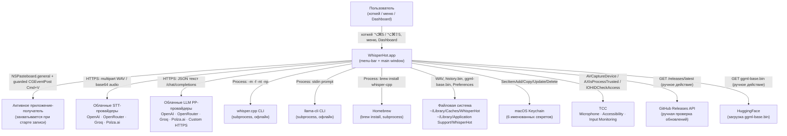
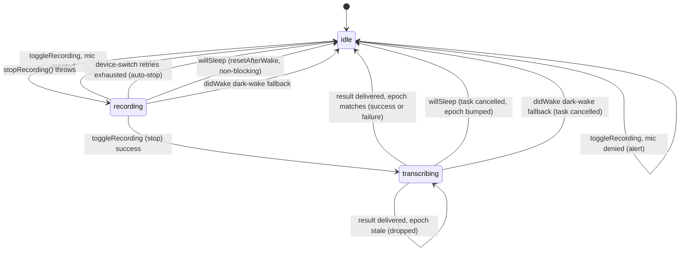
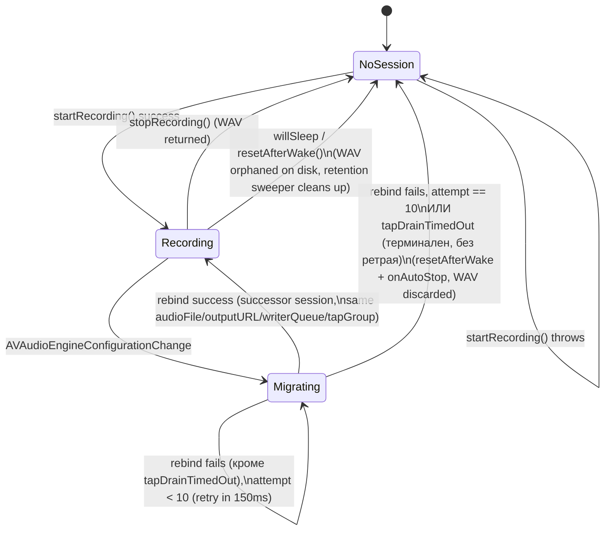
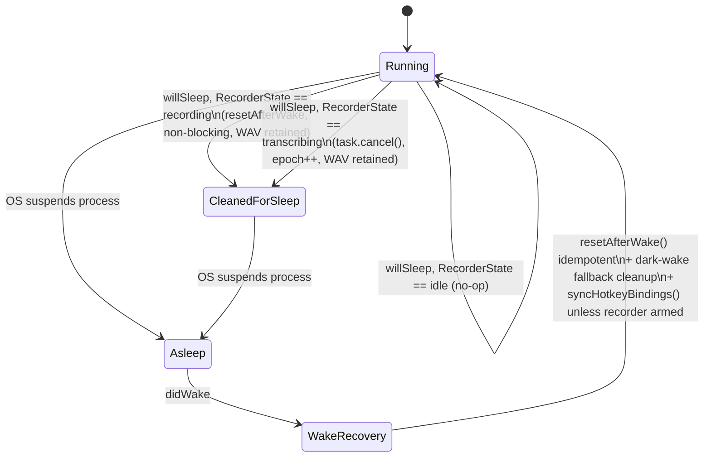

# SPEC: WhisperHot

**Версия документа:** v1.0
**Дата:** 2026-07-27
**Статус:** Draft
**Источник требований:** [`PRD.md`](PRD.md) — «что и зачем» (15 модулей раздела 3, 67 критериев приёмки раздела 6, нефункциональные требования раздела 4)
**Источник структуры кода:** [`ARCHITECTURE.md`](ARCHITECTURE.md) — карта модулей, data flow, threading model; этот документ **не дублирует** её, а добавляет нормативные контракты поверх описанной там структуры
**Текущая версия продукта:** 0.9.1 (`VERSION:1`, `Resources/Info.plist:22`, `CHANGELOG.md:5`, `landing/lib/version.ts:1` — все четыре источника версии синхронизированы на момент написания)

## Как читать этот документ

### Уровни требований (RFC 2119)

Каждое нормативное утверждение использует ровно одно из следующих слов; их русские эквиваленты используются последовательно по всему документу:

| RFC 2119 | Используется в тексте как |
|---|---|
| MUST / REQUIRED | **ОБЯЗАН** / **ОБЯЗАНА** / **ОБЯЗАНЫ** |
| MUST NOT | **НЕ ДОЛЖЕН** / **НЕ ДОЛЖНА** / **НЕ ДОЛЖНЫ** |
| SHOULD | **СЛЕДУЕТ** |
| SHOULD NOT | **НЕ СЛЕДУЕТ** |
| MAY | **МОЖЕТ** |

### Схема идентификаторов

Каждое нормативное требование в разделе 7 получает стабильный идентификатор `SR-<домен>-<номер>` (Specification Requirement), например `SR-AUD-004`. Домены:

| Домен | Область |
|---|---|
| `SR-AUD-*` | Аудиозахват и устройства ввода |
| `SR-HK-*` | Глобальные хоткеи |
| `SR-STT-*` | Транскрипция, провайдеры, технический словарь |
| `SR-LLM-*` | Пост-обработка LLM и пресеты |
| `SR-PASTE-*` | Вставка текста в активное приложение |
| `SR-CTX-*` | Контекстный роутинг |
| `SR-HIST-*` | История транскриптов |
| `SR-SEC-*` | Безопасность и приватность |
| `SR-UI-*` | Интерфейс, индикатор, локализация |
| `SR-PERM-*` | Системные разрешения (TCC) |
| `SR-REL-*` | Сборка, подпись, релиз |
| `SR-PERF-*` | Производительность и численные лимиты |

Идентификаторы уникальны и стабильны: при изменении конкретного требования его номер не переиспользуется для другого поведения.

### Заземление (grounding)

Каждое нормативное требование сопровождается ссылкой одного из трёх видов: `путь/файл.swift:строки` (точный код на 0.9.1), `ADR-NNN` (запись в `decisions.md`), либо `PRD §N.M` / `AC-N.k` (раздел PRD). Пункты, для которых источник истины в репозитории не найден, помечены **[УТОЧНИТЬ]** с указанием, где заведено обсуждение (см. раздел 14). Пункты, выведенные логически из нескольких источников, а не процитированные дословно, помечены **[ИНФЕРЕНЦИЯ]**.

### Что помечено `[ПЛАНИРУЕТСЯ]`

Streaming-транскрипция и Windows-порт нигде в этом документе не описываются как текущее поведение системы — они принятые, но не реализованные цели продукта (`docs/streaming-plan.md`, `docs/windows-support-plan.md`, ADR-016). Единственное упоминание планируемого поведения — раздел 1 («Область и границы»), и оно явно помечено `[ПЛАНИРУЕТСЯ]`.

---

## 1. Область и границы

### 1.1 Что входит в систему

WhisperHot — macOS-приложение (menu-bar статус-элемент + полноценное главное окно), написанное на Swift 5.9 / SwiftPM, 0 внешних зависимостей (`Package.swift:1-23`, ADR-002). В область этого SPEC входит:

- Захват голоса, конвейер транскрипции (5 провайдеров STT), опциональная LLM-постобработка (6 провайдеров), контекстный роутинг, технический словарь, вставка текста, история, индикатор записи, все экраны Settings/Onboarding/Setup, локализация (ru/en) — весь код в `Sources/WhisperHot/` (48 файлов, ~8940 строк, `ARCHITECTURE.md:3-6`).
- Локальная установка whisper.cpp/модели через Homebrew + HuggingFace (`WhisperInstaller`), ручная проверка обновлений через GitHub Releases API (`UpdateChecker`).
- Сборка, подпись, нотаризация и упаковка в DMG (`build.sh`, `build-dmg.sh`, `Package.swift`).

### 1.2 Что вне системы (внешние зависимости, не контролируются этим SPEC)

| Компонент | Почему вне системы |
|---|---|
| Облачные STT/LLM API (OpenAI, OpenRouter, Groq, Polza.ai, произвольный HTTPS-endpoint) | Сторонние сервисы; WhisperHot нормирует только контракт запроса/ответа на своей стороне (раздел 6), не их внутреннее поведение |
| `whisper.cpp` / `llama-cli` (бинарники) | Сторонние open-source проекты, запускаются как `Process`; SPEC нормирует только контракт вызова (аргументы, обработка кода выхода — SR-STT-009, SR-LLM-009), не их внутреннюю реализацию |
| Homebrew | Внешний пакетный менеджер, вызывается как subprocess при установке `whisper-cpp` (ADR-010) |
| macOS Keychain / TCC (Microphone, Accessibility, Input Monitoring) | Системные сервисы Apple; WhisperHot использует только документированные публичные API (`Security`, `AVFoundation`, `ApplicationServices`, `IOKit.hid`) |
| GitHub Releases API, HuggingFace | Внешние HTTP-сервисы, используемые для проверки обновлений и загрузки модели соответственно |
| `landing/` (Next.js сайт) | Отдельное Next.js-приложение; в этом SPEC упоминается только как потребитель `VERSION` (раздел 11), само оно вне области |

### 1.3 Поддерживаемые платформы

- macOS **13.0 (Ventura) и новее** — `Package.swift:6` (`.macOS(.v13)`), `Resources/Info.plist:26` (`LSMinimumSystemVersion=13.0`).
- Только **Apple Silicon** (M1 и новее); Intel Mac **НЕ ДОЛЖЕН** считаться поддерживаемой конфигурацией — README.md:86-90 (via `ScoutOps §9`); в коде это следствие того, что `WhisperInstaller.brewPaths`/`whisperPaths` ищут только `/opt/homebrew/...` и Intel-путь `/usr/local/...` как fallback, а не первичную цель (`WhisperInstaller.swift:29-32,35-40`).

### 1.4 Явные не-цели

- **Windows** `[ПЛАНИРУЕТСЯ]` — требование принято (ADR-016), план зафиксирован в `docs/windows-support-plan.md`, но ни одна строка кода этого репозитория не реализует Windows-адаптеры; текущая кодовая база глубоко завязана на AppKit/AVFoundation/Keychain/TCC/Carbon и не портируется без отдельного platform-neutral core.
- **Streaming-транскрипция** `[ПЛАНИРУЕТСЯ]` — статус «ОТЛОЖЕНО, приоритет P3 XL» (`docs/streaming-plan.md:1-5`). Текущий конвейер всегда пишет полный WAV, отправляет его целиком после остановки записи и не показывает частичный текст во время речи.
- **Продуктовая телеметрия/аналитика** — осознанно отсутствует. Ни один внешний SDK аналитики не подключён (`Package.swift` не объявляет зависимостей); единственный механизм логирования — `NSLog` без уровней/категорий, диагностический для разработчика (`TECH_DEBT_AUDIT.md:64`, F029). Решение о будущей opt-in телеметрии явно вынесено за пределы этого SPEC (см. PRD §5, раздел 14 этого документа).
- **App Sandbox** — не активирован и не планируется без пересмотра архитектуры local-режимов: офлайн-провайдеры запускают внешние исполняемые файлы через `Process`, что несовместимо с sandbox (`Resources/WhisperHot.entitlements:1-8`; `decisions.md:169-182,539`).
- **Автообновление (Sparkle или аналог)** — не реализовано; обновление всегда ручное действие пользователя (SR-REL-011).
- **Формальный accessibility-аудит собственного UI** (VoiceOver, Dynamic Type) — не найден в исследованном срезе кода/документов; не путать с системным разрешением «Accessibility» (`AXIsProcessTrusted`), которое используется для синтеза ввода и не относится к поддержке WhisperHot людьми с инвалидностью (PRD §4, строка «Доступность»).

---

## 2. Системный контекст

Акторы и внешние интерфейсы системы:

Границы контекста:
- **Пользователь** инициирует запись тремя эквивалентными путями (хоткей, пункт меню, кнопка Dashboard) — `MenuBarController.swift:772-792` (PRD §3.1).
- **Активное приложение-получатель** — не постоянный актор, а снимок `NSWorkspace.shared.frontmostApplication`, сделанный в момент старта записи (`MenuBarController.swift:831-842`).
- **Облачные провайдеры** — WhisperHot не хранит состояние сессии между запросами; каждый вызов независим, аутентифицируется bearer-токеном из Keychain.
- **Локальные подпроцессы** запускаются и завершаются в рамках одной транскрипции/постобработки; собственного демона или долгоживущего процесса WhisperHot не поддерживает.
- **GitHub/HuggingFace** — единственные сетевые действия, не связанные с содержимым диктовки (SR-SEC-012).

---

## 3. Модель компонентов

Ниже — по одному компоненту на архитектурный слой, определённый в `ARCHITECTURE.md`. Для каждого: ответственность, публичный контракт, инварианты, потокобезопасность, зависимости.

### 3.1 Hotkey

- **Ответственность.** Глобальная активация переключения записи: основной Carbon-хоткей (⌥⌘5) + raw-output вариант (⌥⌘⇧5) + экспериментальный Fn-транспорт.
- **Публичный контракт.** `HotkeyManager.register(combo: Combo = .defaultCombo) -> Bool`, `.unregister()`, `.onHotkey: (() -> Void)?`, `.onRawHotkey: (() -> Void)?`; `HotkeyManager.Combo { keyCode: UInt32, modifiers: UInt32 }` (`HotkeyManager.swift:12-107`). `FnKeyMonitor.start() -> Bool`, `.stop()`, `.onFnKeyPressed: (() -> Void)?` (`FnKeyMonitor.swift:17-78`). `HotkeyRecorderView: View` (SwiftUI, `HotkeyRecorder.swift:121-266`) + `HotkeyFormatter.format(keyCode:modifiers:) -> String`.
- **Инварианты.** Ровно один активный транспорт одновременно (Carbon либо Fn); raw-хоткей не регистрируется, если базовая комбинация уже включает Shift (`HotkeyManager.swift:85-104`); пользователь всегда имеет рабочий keyboard trigger — Fn не отключает Carbon до собственного успешного старта (`ARCHITECTURE.md:282-293`).
- **Потокобезопасность.** Главный поток целиком: Carbon event handler доставляется синхронно на main runloop (`HotkeyManager.swift:6-8`), Fn `CGEventTap` источник добавлен в `CFRunLoopGetMain()`.
- **Зависимости.** `Carbon.HIToolbox`, `CoreGraphics`; владелец — `MenuBarController`; хранилище комбинации — `Preferences` (`hotkeyKeyCode`/`hotkeyModifiers`).

### 3.2 Audio

- **Ответственность.** Захват микрофона, конвертация в целевой WAV-формат, устойчивая к сменам устройства запись, sleep/wake-восстановление движка.
- **Публичный контракт.** `AudioRecorder.startRecording() throws -> URL`, `.stopRecording() throws -> URL`, `.resetAfterWake()`, `.currentRMS: Float` (thread-safe), `.isRecording: Bool` (main-only), `.onAutoStop: (() -> Void)?`, `.onRecordingError: ((String) -> Void)?` (`AudioRecorder.swift:6-122,213-260,346-363`). `AudioError` — 7 кейсов (`AudioError.swift:3-10`).
- **Инварианты.** Ровно одна `ActiveSession` активна одновременно (`sessionLock: OSAllocatedUnfairLock<ActiveSession?>`); successor-сессия после миграции устройства делит `audioFile`/`outputURL`/`writerQueue`/`tapGroup` с предшественником (ADR-019); поздний tap-callback никогда не пишет в чужую сессию (session-id gate, `AudioRecorder.swift:264-277`).
- **Потокобезопасность.** Lifecycle-методы (`startRecording`/`stopRecording`/`resetAfterWake`) — главный поток (`dispatchPrecondition(.onQueue(.main))`); tap-callback (`processTapBuffer`) — real-time аудио-поток движка; запись на диск — per-session serial `writerQueue` (`DispatchQueue`, qos `.userInitiated`); RMS и session-slot защищены `OSAllocatedUnfairLock` (`AudioRecorder.swift:88-92`).
- **Зависимости.** `AVFoundation`, `CoreAudio`; владелец — `MenuBarController` (подписывается на `onAutoStop`/`onRecordingError`).

### 3.3 Transcription + Providers

- **Ответственность.** Единый протокол для 5 взаимозаменяемых STT-провайдеров, офлайн-фоллбек, опциональная гонка по таймауту.
- **Публичный контракт.** `protocol TranscriptionService: Sendable { func transcribe(audioURL: URL, options: TranscriptionOptions) async throws -> TranscriptionResult }` (`TranscriptionService.swift:64-66`); `TranscriptionOptions { language, prompt, model }`; `TranscriptionResult { text, providerModel, postProcessing, usedOfflineFallback }`; `TranscriptionError` — 11 кейсов (`TranscriptionError.swift:3-14`); `TranscriptionCoordinator: Sendable` struct, `.run(audioURL:options:) async -> Outcome`, `static .fromPreferences(provider:recordingTarget:wantsRawOutput:) -> TranscriptionCoordinator` (`TranscriptionCoordinator.swift:11-225`); `FallbackTranscriptionService: TranscriptionService` (`FallbackTranscriptionService.swift:15-155`); `enum Endpoints` — 8 захардкоженных `https://` URL (`Endpoints.swift:7-29`).
- **Инварианты.** Провайдер выбирается заново на каждый `kickOffTranscription` (SR-STT-002); офлайн-фоллбек срабатывает только на `notConnectedToInternet`/`networkConnectionLost` или явную гонку по таймауту, никогда на 401/403/5xx (ADR-013); local-primary отключает гонку по таймауту (`TranscriptionCoordinator.swift:117-121`).
- **Потокобезопасность.** `Sendable`-типы; исполняются в `Task.detached(priority: .userInitiated)` вне main; `fromPreferences` — `@MainActor` (снимок `Preferences`/`Keychain` до запуска фоновой задачи).
- **Зависимости.** `Networking` (`HTTPClient`, `Endpoints`), `Keychain`, `Preferences`, `WordReplacement`, `PostProcessing`, `ContextRouter`.

### 3.4 PostProcessing

- **Ответственность.** Опциональная LLM-очистка/переформатирование транскрипта по одному из 6 пресетов, облачно или локально.
- **Публичный контракт.** `enum PostProcessingPreset` — 6 кейсов + `.systemPrompt(custom:) -> String` (`PostProcessingPreset.swift:6-51`); `struct PostProcessingOptions { preset, customPrompt, model }`; `final class LLMPostProcessor: @unchecked Sendable { func process(text:options:) async throws -> String }` (`LLMPostProcessor.swift:7-108`); `final class LocalLLMProcessor: @unchecked Sendable { func process(text:options:) async throws -> String }` (`LocalLLMProcessor.swift:9-135`); `enum PostProcessingError` — 7 кейсов (`PostProcessingPreset.swift:62-69`); `enum PostProcessingProvider` — 6 кейсов + `.endpoint`/`.keychainAccount`/`.extraHeaders` (`Preferences.swift:460-521`).
- **Инварианты.** Постобработка всегда получает текст после замен слов, никогда сырой STT (`TranscriptionCoordinator.swift:40-77`); сбой постобработки никогда не блокирует доставку текста; `usedOfflineFallback=true` принудительно пропускает постобработку.
- **Потокобезопасность.** `@unchecked Sendable`-классы, вызываются из `Task.detached`; HTTP — через `HTTPClient.shared`.
- **Зависимости.** `Networking`, `Keychain`, `Preferences`, `ContextRouter` (через координатор).

### 3.5 ContextRouter

- **Ответственность.** Автовыбор пресета постобработки по целевому приложению (и опционально заголовку окна).
- **Публичный контракт.** `enum ContextRouter { static func resolve(target: NSRunningApplication?, rules: [ContextRule]) -> PostProcessingPreset }` (`ContextRouter.swift:28-71`); `struct ContextRule { id, bundleID, titleContains, label, presetRawValue }` + `.defaults` (18 правил, `ContextRule.swift:8-63`).
- **Инварианты.** Первое совпавшее по порядку списка правило побеждает; `bundleID == "*"` — безусловный catch-all (`ContextRouter.swift:50-53`); при отсутствии разрешения Accessibility title-правила молча пропускаются, а не дают ошибку (`ContextRouter.swift:58-65,75-92`).
- **Потокобезопасность.** Чистая функция; единственный побочный эффект — синхронный cross-process AX-запрос (~1-5 мс, `decisions.md:79`), вызывается на `@MainActor` внутри `TranscriptionCoordinator.fromPreferences`.
- **Зависимости.** `AppKit` (`NSRunningApplication`, `AXUIElement`), `Preferences.contextRules`, `PostProcessingPreset`.

### 3.6 Paste

- **Ответственность.** Доставка финального текста в буфер обмена и (с охраной) в целевое приложение через синтетический Cmd+V.
- **Публичный контракт.** `@MainActor final class PasteService { func deliver(text: String, targetApp: NSRunningApplication?) -> Outcome }` (`PasteService.swift:9-108`); `enum Outcome` — 8 кейсов + `.isPasted`/`.description` (`PasteService.swift:11-46`).
- **Инварианты.** Запись в pasteboard — всегда первый шаг (`PasteService.swift:53-59`); ровно 6 guard-ветвей в фиксированном порядке перед синтезом клавиш (`PasteService.swift:61-101`); при `IsSecureEventInputEnabled()==true` синтез клавиш НИКОГДА не выполняется.
- **Потокобезопасность.** Только главный поток (`dispatchPrecondition(.onQueue(.main))`, `PasteService.swift:51`).
- **Зависимости.** `AppKit` (`NSPasteboard`, `NSWorkspace`), `ApplicationServices` (`AXIsProcessTrusted`), `CoreGraphics` (`CGEventPost`), `Carbon.HIToolbox` (`IsSecureEventInputEnabled`).

### 3.7 History

- **Ответственность.** Опциональный зашифрованный локальный журнал успешных транскрипций.
- **Публичный контракт.** `@MainActor final class HistoryStore { records: [TranscriptRecord], loadIfNeeded() throws, load() throws, append(_:) throws, clear() throws, pruneNow() throws }` (`HistoryStore.swift:11-181`); `enum HistoryError` — 5 кейсов (`HistoryStore.swift:13-29`); `struct TranscriptRecord` — плоский `Codable` (`TranscriptRecord.swift:6-62`).
- **Инварианты.** `append` всегда вставляет в начало (newest-first) и обрезает по возрасту и по числу записей (`HistoryStore.swift:147-156,177-195`); ключ шифрования никогда не генерируется заново, если существующий ciphertext стал бы недешифруемым — четырёхшаговая машина состояний (`HistoryStore.swift:233-292`, раздел 5.2).
- **Потокобезопасность.** `@MainActor` целиком.
- **Зависимости.** `CryptoKit` (`AES.GCM`), `Keychain`, `Preferences` (retention), `FileManager` (`~/Library/Application Support/WhisperHot/history.bin`).

### 3.8 Keychain

- **Ответственность.** Единая обёртка над Security framework для 6 именованных секретов.
- **Публичный контракт.** `enum Keychain { enum Account (6 кейсов), enum KeychainError (3 кейса), static func save(apiKey:account:service:) throws, static func readAPIKey(account:service:) throws -> String, static func delete(account:service:) throws, static func saveData(_:account:service:) throws, static func readData(account:service:) throws -> Data }` (`Keychain.swift:6-153`).
- **Инварианты.** Каждый item создаётся с `kSecAttrAccessibleWhenUnlockedThisDeviceOnly` + `kSecAttrSynchronizable=false` (`Keychain.swift:107-119` via `ScoutData §3`); сохранение — `SecItemUpdate`, при `errSecItemNotFound` — `SecItemAdd` (`Keychain.swift:81-121`).
- **Потокобезопасность.** Не помечен `@MainActor`; синхронные блокирующие вызовы Security framework, вызывается либо с main (Settings UI), либо синхронно внутри `Sendable`-closures провайдеров.
- **Зависимости.** `Security`.

### 3.9 Privacy (AudioRetentionSweeper)

- **Ответственность.** Принудительное соблюдение политики хранения сырого WAV на диске.
- **Публичный контракт.** `@MainActor enum AudioRetentionSweeper { static var activeRecordingURL: URL?, static func sweepStragglers(), static func wipeAll(includingActive: Bool = false), static func delete(_ url: URL) }` (`AudioRetentionSweeper.swift:9-111`).
- **Инварианты.** `sweepStragglers()` никогда не удаляет `activeRecordingURL` (`AudioRetentionSweeper.swift:46-49`); `wipeAll(includingActive: false)` тоже защищает активную запись — только `includingActive: true` (только shutdown-путь `.untilQuit`) удаляет её.
- **Потокобезопасность.** `@MainActor`.
- **Зависимости.** `FileManager`, `Preferences.audioRetention`.

### 3.10 LocalSetup

- **Ответственность.** One-click установка whisper.cpp (Homebrew) + модели (HuggingFace); ручная проверка обновлений через GitHub Releases.
- **Публичный контракт.** `@MainActor final class WhisperInstaller: ObservableObject { status: Status (5 кейсов), isReady: Bool, install() async, cancel(), findWhisperBinary() -> String? }` (`WhisperInstaller.swift:12-252`); `@MainActor final class UpdateChecker: ObservableObject { status: Status (5 кейсов), check(force:) async, openDownload(), currentVersion: String }` (`UpdateChecker.swift:6-122`).
- **Инварианты.** `brewPaths`/`whisperPaths` — фиксированные списки из 2/4 путей (ARM64 + Intel fallback, `WhisperInstaller.swift:29-40`); модель валидируется только по HTTP-статусу и минимальному размеру, без криптографической контрольной суммы (SR-PERF-010); `UpdateChecker` кэширует непринудительную проверку на 3600 с.
- **Потокобезопасность.** `@MainActor` + `ObservableObject` (прямой SwiftUI bind).
- **Зависимости.** `Foundation` (`Process`, `URLSession`), `Preferences` (синхронизация путей после установки).

### 3.11 UI/Indicator

- **Ответственность.** Плавающая всегда-поверх HUD-панель, показывающая состояние записи/транскрибации, живой уровень звука, время, цель вставки.
- **Публичный контракт.** `@MainActor final class IndicatorController { func show(destination: String? = nil), func showTranscribing(), func hide() }` (`IndicatorController.swift:15-56`); `@MainActor final class IndicatorViewModel: ObservableObject { @Published rms, elapsed, isActive, mode, destination; func start(destination:), func startTranscribing(), func stop() }` (`IndicatorViewModel.swift:8-89`); `enum IndicatorStyle` — 2 кейса (`Preferences.swift:451-456`).
- **Инварианты.** Панель не скрывается между `recording`/`transcribing` (SR-UI-002); RMS обновляется только в режиме `recording`; позиция — верхний центр активного экрана, отступ 12 pt.
- **Потокобезопасность.** `@MainActor`.
- **Зависимости.** `AppKit` (`NSPanel`, `NSScreen`), `SwiftUI` (`NSHostingView`), `Preferences.indicatorStyle`.

### 3.12 Settings

- **Ответственность.** Единственный источник истины для 35 типизированных настроек `UserDefaults` + SwiftUI-поверхность для их редактирования (встроена в главное окно и в отдельное legacy-окно).
- **Публичный контракт.** `public enum Preferences { enum Key (35 констант String), enum Defaults, static func registerDefaults(), ~30 типизированных static var accessors }` (`Preferences.swift:7-419`); сопутствующие `enum AudioRetention` (5 кейсов), `IndicatorStyle` (2), `PostProcessingProvider` (6), `TranscriptionProvider` (5).
- **Инварианты.** Каждый accessor имеет безопасный fallback на `Defaults` при отсутствующем/некорректном значении — ни один accessor не может вернуть `nil`/упасть (например `historyMaxEntries` — `raw > 0 ? raw : Defaults.historyMaxEntries`, `Preferences.swift:339-342`); `registerDefaults()` вызывается ровно один раз при старте.
- **Потокобезопасность.** Чистые вычисляемые свойства над `UserDefaults.standard` (сам по себе потокобезопасен); вызывается и с main (SwiftUI `@AppStorage`), и из `TranscriptionCoordinator.fromPreferences` на `@MainActor`.
- **Зависимости.** `Foundation.UserDefaults`, `Carbon.HIToolbox` (дефолтные `keyCode`/`modifiers`).

### 3.13 Localization

- **Ответственность.** Двуязычный (ru/en) каталог строк UI без Apple `.lproj`-бандлов.
- **Публичный контракт.** `enum L10n` — static computed properties/functions по разделам UI (`L10n.swift:3-376`); `enum AppLanguage` — 2 кейса (ru, en).
- **Инварианты.** Ровно 2 языка; повреждённое/недопустимое сохранённое значение откатывается к `.ru`; строки menu bar перечитываются только на `menuWillOpen`, не мгновенно при смене настройки (ADR-009).
- **Потокобезопасность.** Чистые статические вычисляемые свойства, вызываются с главного потока (SwiftUI/AppKit UI-код).
- **Зависимости.** `Preferences.appLanguage`.

---

## 4. Машины состояний

### 4.1 Состояние записи (`MenuBarController.RecorderState`)

Три состояния: `idle`, `recording`, `transcribing` (`MenuBarController.swift:60-64`). Отдельного состояния ошибки нет — сбои возвращают автомат в `idle` с побочным эффектом (баннер/alert), а не переводят в отдельный error-state.

| Состояние | Событие | Новое состояние | Действие | Заземление |
|---|---|---|---|---|
| `idle` | `toggleRecording`, разрешение Microphone выдано/выдаётся | `recording` | `captureRecordingTarget()`, `audioRecorder.startRecording()`, `indicatorController.show()`, start-chime | `MenuBarController.swift:772-823` |
| `idle` | `toggleRecording`, Microphone отклонён | `idle` | `showMicrophoneDeniedAlert()` (модальный `NSAlert`) | `MenuBarController.swift:779-792,1158-1173` |
| `idle` | `audioRecorder.startRecording()` бросает не-mic ошибку | `idle` | лог, откат `recordingTarget`/`currentRecordingURL`/`activeRecordingURL`, отдельного alert нет | `MenuBarController.swift:817-822` |
| `recording` | `toggleRecording` (стоп) успешен | `transcribing` | stop-chime, `indicatorController.showTranscribing()`, `kickOffTranscription()` | `MenuBarController.swift:860-871` |
| `recording` | `audioRecorder.stopRecording()` бросает | `idle` | сброс UI/target/URL, транскрипция НЕ запускается | `MenuBarController.swift:872-881` |
| `recording` | смена устройства, все ретраи миграции исчерпаны (auto-stop) | `idle` | `handleAutoStop()` — partial recording НЕ транскрибируется | `MenuBarController.swift:884-894` |
| `recording` | `willSleep` | `idle` | `audioRecorder.resetAfterWake()` (неблокирующий) + `resetControllerStateToIdle()`, WAV НЕ удаляется | `MenuBarController.swift:390-399` |
| `recording` | `didWake`, автомат всё ещё `.recording` (dark-wake fallback) | `idle` | `resetControllerStateToIdle()` | `MenuBarController.swift:439-441` |
| `transcribing` | любая активация хоткея/меню/Dashboard | `transcribing` (без изменений) | лог «hotkey ignored — transcription in flight», без побочных эффектов | `MenuBarController.swift:777-778` |
| `transcribing` | `deliverTranscriptionResult`, эпоха совпадает, `.success` | `idle` | `finishTranscription(.success)`: paste/copy, done-chime, история (если включена), ретенция WAV | `MenuBarController.swift:944-1014` |
| `transcribing` | `deliverTranscriptionResult`, эпоха совпадает, `.failure` | `idle` | error-баннер, WAV НЕ удаляется | `MenuBarController.swift:1015-1022` |
| `transcribing` | `deliverTranscriptionResult`, эпоха НЕ совпадает (устаревший результат) | `transcribing` (без изменений) | результат тихо отброшен | `MenuBarController.swift:944-948` |
| `transcribing` | `willSleep` | `idle` | `transcriptionTask.cancel()`, `transcriptionEpoch += 1`, `resetControllerStateToIdle()`, WAV НЕ удаляется | `MenuBarController.swift:374-388` |
| `transcribing` | `didWake`, автомат всё ещё `.transcribing` (dark-wake fallback) | `idle` | `transcriptionTask.cancel()`, `transcriptionEpoch += 1`, `resetControllerStateToIdle()` | `MenuBarController.swift:442-446` |

### 4.2 Жизненный цикл `ActiveSession` в `AudioRecorder`, включая миграцию при смене устройства (ADR-019)

`ActiveSession` — приватная структура, владеющая `converter`/`audioFile`/`inputFormat`/`outputURL`/`tapGroup`/`writerQueue`; ровно один экземпляр активен одновременно (`sessionLock`).

| Состояние | Событие | Новое состояние | Действие | Заземление |
|---|---|---|---|---|
| нет сессии | `startRecording()` — все проверки прошли | активная сессия #N | создать `converter`/`file`/`tap` (`bufferSize: 4096`), `engine.start()`, `isRecording=true` | `AudioRecorder.swift:122-211` |
| нет сессии | `startRecording()` бросает (`microphoneAccessDenied`/`invalidInputFormat`/`converterUnavailable`/`engineStartFailed`) | нет сессии | откат (удаление созданного файла), `isRecording` остаётся `false` | `AudioRecorder.swift:125-207` |
| активная сессия | `stopRecording()` | нет сессии, файл возвращён | `removeTap`, `engine.stop()`, атомарный захват+очистка `sessionLock`, `tapGroup.wait()`, `writerQueue.sync{}`, `return outputURL` | `AudioRecorder.swift:213-260` |
| активная сессия | `.AVAudioEngineConfigurationChange`, `isRecording==true` | `migrating` (generation++) | `removeTap`, `engine.stop()`, `attemptDeviceSwitch(attempt:0, generation:)` | `AudioRecorder.swift:394-411` |
| `migrating` | `rebindActiveSessionToCurrentDevice()` успех | активная сессия #N+1 (successor, наследует `audioFile`/`outputURL`/`writerQueue`/`tapGroup`, новый `id`/`converter`/`inputFormat`) | новый tap, `installConfigurationObserver()`, `engine.start()` | `AudioRecorder.swift:452-504`; ADR-019 |
| `migrating` | рестарт бросает, `attempt+1 < 10` | `migrating` (то же generation) | `DispatchQueue.main.asyncAfter(+150ms)` → повторная попытка | `AudioRecorder.swift:427-437` |
| `migrating` | рестарт бросает, `attempt+1 == 10` (give-up) | нет сессии | `resetAfterWake()` (неблокирующий) + `onAutoStop?()` — WAV не транскрибируется | `AudioRecorder.swift:428-433` |
| активная сессия (любая) | `willSleep`/`resetAfterWake()` вызван вручную | нет сессии, WAV orphaned на диске | `rebuildEngine()`, `sessionLock=nil`, `isRecording=false`, RMS=0 — НЕ ждёт `tapGroup`/`writerQueue` | `AudioRecorder.swift:346-363` |
| `migrating` | любой новый lifecycle-переход (start/stop/reset) до resolve | (generation инвалидировано) | `invalidatePendingDeviceSwitch()`; отложенный ретрай со старым generation молча дропается | `AudioRecorder.swift:417,509-512` |

**Ключевой инвариант ADR-019 (порядок операций).** Миграция трёхфазна, и живая сессия трогается **раньше** последнего fallible-шага — это надо читать буквально, потому что более короткая формулировка «всё fallible выполняется до изменения живой сессии» **неверна**. Фаза A (сессия нетронута): пересборка движка, чтение формата, создание конвертера — отказ здесь оставляет исходную сессию как есть. Фаза B: `sessionLock` **очищается**, затем идёт ограниченный `tapGroup.wait(timeout: tapDrainTimeout=500мс)`; при таймауте исходная сессия **возвращается** в слот и бросается `AudioError.tapDrainTimedOut` (`AudioRecorder.swift:485-489`). Фаза C: публикуется successor, ставится tap, вызывается `engine.start()`; при его отказе в слоте намеренно остаётся **successor** — он владеет тем же `audioFile` / `outputURL` / `writerQueue` / `tapGroup`, и ретрай продолжает тот же дубль. Инвариант, который действительно держится на ретрай-путях: дубль не теряется, и один `AVAudioFile` никогда не отдаётся двум писателям одновременно. Терминальный выход — исчерпание попыток (SR-AUD-012) либо `tapDrainTimedOut` (SR-AUD-019) — дубль **выбрасывает**: `abandonSwitch` → `resetAfterWake()` → `onAutoStop()`, частичная запись не транскрибируется (SR-AUD-013, §8.1).

### 4.3 Sleep/wake recovery (ADR-015)

Это не самостоятельный автомат состояний записи, а набор кросс-cutting реакций на `NSWorkspace.willSleepNotification`/`didWakeNotification`, применяемых поверх состояний из §4.1 и §4.2.

| Состояние на момент события | Событие | Действие | Заземление |
|---|---|---|---|
| `RecorderState == .idle` | `willSleep` | нет действия | `MenuBarController.swift:401-403` |
| `RecorderState == .recording` | `willSleep` | `audioRecorder.resetAfterWake()` (неблокирующий) + `resetControllerStateToIdle()`; WAV НЕ удаляется | `MenuBarController.swift:390-399` |
| `RecorderState == .transcribing` | `willSleep` | `transcriptionTask.cancel()`, `transcriptionEpoch += 1`, `resetControllerStateToIdle()`; WAV НЕ удаляется | `MenuBarController.swift:374-388` |
| любое | `didWake` | `audioRecorder.resetAfterWake()` безусловно и идемпотентно | `MenuBarController.swift:427-431` |
| `RecorderState == .recording`, переживший сон без `willSleep` (dark-wake) | `didWake` | `resetControllerStateToIdle()` | `MenuBarController.swift:439-441` |
| `RecorderState == .transcribing`, переживший сон без `willSleep` (dark-wake) | `didWake` | `transcriptionTask.cancel()`, `transcriptionEpoch += 1`, `resetControllerStateToIdle()` | `MenuBarController.swift:442-446` |
| `isHotkeyRecorderArmed == false` | `didWake`, после очистки состояния | `syncHotkeyBindings()` — защита от протухшего `EventHotKeyRef` | `MenuBarController.swift:454-455` |
| `isHotkeyRecorderArmed == true` | `didWake` | пересинхронизация хоткея пропускается до явного disarm | `MenuBarController.swift:454` |
| Облачный HTTP-запрос в полёте | сон → пробуждение, сокет закрыт ядром «под капотом» | ограничен `timeoutIntervalForResource=180с` (а не `URLSession.shared`-дефолтом в 7 дней) | `HTTPClient.swift:3-33`; ADR-015 |
| Локальный subprocess (`whisper.cpp`/`llama-cli`) выполняется | `willSleep` (`Task.cancel()`) | **НЕ останавливается** — continuation без cancellation handler; subprocess МОЖЕТ продолжать расходовать CPU после сна | `MenuBarController.swift:361-367`; `decisions.md:314` (ADR-015, «Последствия») |

**Известное ограничение.** `LocalWhisperProvider`/`LocalLLMProcessor` оборачивают `Process` в `withCheckedThrowingContinuation` без `withTaskCancellationHandler`; `Task.cancel()` на `willSleep` помечает Swift-задачу отменённой, но не посылает сигнал дочернему процессу — он продолжает работать до штатного завершения. Это заведомый, задокументированный компромисс (ADR-015 «Последствия», `TECH_DEBT_AUDIT.md` F026), а не необнаруженный дефект — см. раздел 14.

---

## 5. Форматы данных и хранение

### 5.1 WAV (записанное аудио)

| Параметр | Значение | Заземление |
|---|---|---|
| Формат | Linear PCM, `kAudioFormatLinearPCM` | `AudioRecorder.swift:154` |
| Частота дискретизации | 16 000 Гц | `AudioRecorder.swift:105-112,155` |
| Каналы | 1 (mono) | `AudioRecorder.swift:105-112,156` |
| Разрядность | 16 бит, signed integer, little-endian, interleaved | `AudioRecorder.swift:105-112,157-160` |
| Расширение файла | `.wav` | `AudioRecorder.swift:602` |
| Путь | `~/Library/Caches/WhisperHot/recordings/<UUID>.wav` (`.cachesDirectory` + `WhisperHot/recordings` + `UUID().uuidString + ".wav"`) | `AudioRecorder.swift:592-604` |
| Размер буфера захвата | 4096 фреймов на tap-callback | `AudioRecorder.swift:192,490` |

### 5.2 История транскриптов и её шифрование

| Параметр | Значение | Заземление |
|---|---|---|
| Путь файла | `~/Library/Application Support/WhisperHot/history.bin` | `HistoryStore.swift:83-97` |
| Формат до шифрования | JSON-массив `[TranscriptRecord]`, ISO-8601 даты | `HistoryStore.swift:47-51` |
| Алгоритм шифрования | AES-GCM (CryptoKit), `sealed.combined` записывается атомарно | `HistoryStore.swift:1-2,197-231` |
| Длина ключа | 256 бит (32 байта) | `HistoryStore.swift:1-2` (`SymmetricKey(size: .bits256)`) |
| Хранилище ключа | Keychain, account `history-encryption-key`, raw `Data` | `Keychain.swift:12-16`; `HistoryStore.swift:282-292` |
| Порядок записей | Newest-first (вставка в индекс 0) | `HistoryStore.swift:147-156` |

**Машина состояний ключа шифрования** (`HistoryStore.encryptionKey()`, `HistoryStore.swift:233-292`):

| Шаг | Условие | Результат |
|---|---|---|
| 1 | `Keychain.readData(.historyEncryptionKey)` | только `itemNotFound` трактуется особо; любой другой Keychain-error → `HistoryError.encryptionFailed` |
| 2a | Ключ присутствует, длина ровно 32 байта | `SymmetricKey(data:)` возвращается; новый ключ НЕ создаётся |
| 2b | Ключ присутствует, длина ≠ 32 байта | `HistoryError.decryptionFailed` |
| 3 | Ключа нет, но `history.bin` существует (orphan) | `HistoryError.decryptionFailed`; замена ключа НЕ создаётся, старый ciphertext остаётся недешифруемым до `Clear all` |
| 4 | Ключа нет и `history.bin` нет (true first-use) | генерируется 256-битный ключ, сохраняется в Keychain, возвращается вызывающему |

### 5.3 Keychain — 6 именованных аккаунтов

| Account (raw value) | Тип payload | Назначение |
|---|---|---|
| `openai-api-key` | UTF-8 строка | OpenAI STT + PP bearer-ключ |
| `openrouter-api-key` | UTF-8 строка | OpenRouter STT + PP bearer-ключ |
| `groq-api-key` | UTF-8 строка | Groq STT + PP bearer-ключ |
| `polzaai-api-key` | UTF-8 строка | Polza.ai STT + PP bearer-ключ |
| `custom-endpoint-api-key` | UTF-8 строка | Custom HTTPS PP-endpoint bearer-ключ |
| `history-encryption-key` | raw 32-байтовый `Data` | AES-GCM ключ для истории (§5.2) |

Все items — `kSecClassGenericPassword`, service `com.aleksejsupilin.WhisperHot`, `kSecAttrAccessibleWhenUnlockedThisDeviceOnly`, `kSecAttrSynchronizable=false` (`Keychain.swift:33-37,107-119`).

### 5.4 Ключи `Preferences` — полная таблица (35 ключей)

Общий namespace ключей — `WhisperHot.<name>` (`Preferences.swift:9-43`); дефолты — `Preferences.swift:47-81`; `registerDefaults()` — `Preferences.swift:85-121`.

| Ключ (`Preferences.Key`) | Тип | Default | Влияние |
|---|---|---|---|
| `provider` | `TranscriptionProvider` (String) | `openai` | STT-провайдер для следующей записи |
| `modelOpenAI` | String | `gpt-4o-mini-transcribe` | Модель OpenAI STT (и Polza.ai — общий ключ, `Preferences.swift:210`) |
| `modelOpenRouter` | String | `openai/gpt-4o-audio-preview` | Модель OpenRouter audio-chat |
| `modelGroq` | String | `whisper-large-v3-turbo` | Модель Groq STT |
| `localWhisperBinaryPath` | String | `""` | Путь к `whisper.cpp` CLI (STT + офлайн-фоллбек) |
| `localWhisperModelPath` | String | `""` | Путь к GGML-модели `whisper.cpp` |
| `language` | `TranscriptionLanguage` (String) | `auto` | Язык, передаваемый провайдеру (`auto` = не передавать) |
| `autoPaste` | Bool | `true` | Разрешает попытку guarded Cmd+V; иначе только буфер обмена |
| `sounds` | Bool | `true` | start/stop/done chimes |
| `indicatorStyle` | `IndicatorStyle` (String) | `minimal` | Стиль плавающего индикатора |
| `postProcessingEnabled` | Bool | `false` | Включает LLM cleanup |
| `postProcessingPreset` | `PostProcessingPreset` (String) | `cleanup` | Пресет постобработки (ручной, если не переопределён роутером) |
| `postProcessingCustomPrompt` | String | `""` | Custom system-prompt для пресета `custom` |
| `postProcessingModel` | String | `openai/gpt-4o-mini` | Модель для OpenRouter/Polza.ai PP (общий legacy-ключ) |
| `historyEnabled` | Bool | `false` | Включает запись в зашифрованную историю |
| `historyRetentionDays` | Int | `0` (бессрочно) | Возрастной лимит истории: 0/1/7/30/90 |
| `historyMaxEntries` | Int | `100` | Лимит числа записей истории: 10…1000, шаг 10 |
| `audioRetention` | `AudioRetention` (String) | `immediate` | Политика хранения сырого WAV |
| `fnKeyEnabled` | Bool | `false` | Экспериментальный Fn-транспорт вместо Carbon |
| `hotkeyKeyCode` | Int | `kVK_ANSI_5` | Virtual key code основной комбинации |
| `hotkeyModifiers` | Int | `cmdKey | optionKey` | Carbon modifier mask основной комбинации |
| `contextRoutingEnabled` | Bool | `false` | Включает автовыбор пресета по активному приложению |
| `contextRules` | JSON `[ContextRule]` | `ContextRule.defaults` (18 правил) | Правила контекстного роутинга |
| `postProcessingProvider` | `PostProcessingProvider` (String) | `openrouter` | Провайдер постобработки |
| `postProcessingModelOpenAI` | String | `gpt-4o-mini` | Модель OpenAI PP |
| `postProcessingModelGroq` | String | `llama-3.1-8b-instant` | Модель Groq PP |
| `customEndpointURL` | String | `""` | URL custom HTTPS PP-endpoint (только `https` принимается) |
| `customEndpointModel` | String | `""` | Имя модели для custom endpoint |
| `localLLMBinaryPath` | String | `""` | Путь к `llama-cli` |
| `localLLMModelPath` | String | `""` | Путь к GGUF-модели |
| `vocabularyHints` | String | `""` | STT prompt bias (технические термины) |
| `wordReplacements` | JSON `[WordReplacement]` | 16 встроенных правил | Пост-транскрипционные замены слов |
| `appLanguage` | `AppLanguage` (String) | `ru` | Язык интерфейса |
| `autoOfflineOnTimeout` | Bool | `false` | Включает race по таймауту cloud→local (только menu bar, нет в SettingsView) |
| `autoOfflineTimeoutSeconds` | Int | `10` | Порог гонки, 1…3600с (собственного UI-контрола нет) |

Ровно 35 ключей (`Preferences.swift:9-43`, подсчитано построчно). Отдельно, **вне** `Preferences.Key`, существует служебный булев ключ `WhisperHot.hasShownOnboarding` (сырая строка в `OnboardingWindowController`, не типизированный accessor) — флаг «онбординг был закрыт», не пользовательская настройка.

### 5.5 Пути на диске (сводно)

| Данные | Путь |
|---|---|
| Сырой WAV записи | `~/Library/Caches/WhisperHot/recordings/<UUID>.wav` |
| Зашифрованная история | `~/Library/Application Support/WhisperHot/history.bin` |
| Автоустановленная модель whisper.cpp | `~/Library/Application Support/WhisperHot/models/ggml-base.bin` (`WhisperInstaller.swift:24-26,44-46,130-131`) |
| Пользовательские модели (local whisper / local LLM) | Путь задаётся пользователем через `NSOpenPanel`; физическое место и жизненный цикл вне контроля WhisperHot |

### 5.6 Политика ретенции аудио

| Политика (`AudioRetention`) | `sweepMaxAgeSeconds` | Поведение |
|---|---|---|
| `.immediate` (default) | 3600 (для stragglers) | Удаление сразу после успеха при выключенной либо успешной истории; при сбое — файл остаётся до startup-sweep |
| `.oneHour` | 3600 | Возрастной sweep раз в запуск/явный вызов |
| `.oneDay` | 86 400 | Возрастной sweep раз в запуск/явный вызов |
| `.untilQuit` | `nil` (age-sweep выключен) | Полный wipe на `applicationWillTerminate` **и** компенсирующе на следующем запуске (force-quit защита) |
| `.forever` | `nil` | Автоматическое удаление отсутствует; только ручной «Wipe all» |

Заземление: `Preferences.swift:424-446`; `AudioRetentionSweeper.swift:30-99`; `AppDelegate.swift:8-20,41-49`.

---

## 6. Внешние интерфейсы

| Адресат | Метод | Тело запроса | Что уходит | Таймаут | Обработка кодов ответа |
|---|---|---|---|---|---|
| OpenAI STT | `POST https://api.openai.com/v1/audio/transcriptions` | multipart: `file`(audio/wav), `model`, опц. `language`, опц. `prompt`, `response_format=json` | Аудио, модель, язык, технический словарь-подсказка | 60с (per-request) / 180с (session cap) | 2xx → JSON `{text}`; иначе `TranscriptionError.httpError(status,body)`, тело обрезано до 300 симв. в UI |
| Groq STT | `POST https://api.groq.com/openai/v1/audio/transcriptions` | тот же класс (`OpenAICompatibleSTTProvider`) | то же | 60с / 180с | то же |
| Polza.ai STT | `POST https://polza.ai/api/v1/audio/transcriptions` | тот же класс, модель = `modelOpenAI` | то же | 60с / 180с | то же |
| OpenRouter STT | `POST https://openrouter.ai/api/v1/chat/completions` | JSON: `model`, `modalities:["text"]`, `temperature:0`, системный промпт «вернуть только транскрипт», `input_audio`(base64 WAV) | Аудио (base64), язык/подсказка в тексте промпта | 120с / 180с | 2xx → `choices[0].message.content`; пусто → `emptyTranscript` |
| OpenAI PP | `POST https://api.openai.com/v1/chat/completions` | JSON: `model`, `temperature:0.2`, `messages`(system+user) | Текст транскрипта (после замен слов) | 60с / 180с | 2xx → content; иначе `PostProcessingError.httpError` |
| Groq PP | `POST https://api.groq.com/openai/v1/chat/completions` | тот же класс | то же | 60с / 180с | то же |
| Polza.ai PP | `POST https://polza.ai/api/v1/chat/completions` | тот же класс | то же | 60с / 180с | то же |
| OpenRouter PP | `POST https://openrouter.ai/api/v1/chat/completions` | тот же класс + заголовки `HTTP-Referer`, `X-Title: WhisperHot` | то же + провайдер-атрибуция | 60с / 180с | то же |
| Custom HTTPS PP | `POST <customEndpointURL>` | тот же класс, требуется схема `https` | Текст, API-ключ выбранного endpoint'а | 60с / 180с | то же |
| GitHub Releases API | `GET https://api.github.com/repos/LexorCrypto/whisper-hot/releases/latest` | без тела, заголовок `Accept: application/vnd.github+json` | Ничего из содержимого диктовки; только сам факт запроса версии | 15с | 403/429 → сообщение о rate-limit; 2xx → сравнение semver; иначе HTTP-код/generic-ошибка |
| HuggingFace | `GET https://huggingface.co/ggerganov/whisper.cpp/resolve/main/ggml-base.bin` | без тела | Ничего пользовательского | не задан явно (delegate-based download) | 2xx + размер ≥1 000 000 байт → успех; иначе `.failed` |
| Homebrew (`brew install whisper-cpp`) | subprocess, не HTTP напрямую | argv `brew install whisper-cpp` | Полное окружение процесса (`ProcessInfo.processInfo.environment`) передаётся subprocess'у как есть — см. SR-SEC-риск F031 | не задан | ненулевой код выхода → `.failed(message)` |

**Полностью офлайн конфигурации:**

| Конфигурация | Сетевые запросы конвейера диктовки |
|---|---|
| Provider = Local whisper.cpp, PP выключен или PP = Local LLM | Ноль запросов — весь конвейер выполняется subprocess'ами (`LocalWhisperProvider.swift:3-8`, `LocalLLMProcessor.swift:3-8`) |
| Provider = любой облачный, PP выключен | STT-запрос уходит; PP-запросов нет |
| Provider = Local whisper.cpp, PP = облачный | Только PP-запрос содержит текст; аудио никуда не уходит |

Ручная проверка обновлений и установка/загрузка локальной модели остаются отдельными сетевыми действиями независимо от выбранной конфигурации провайдеров — они не содержат содержимого диктовки и не считаются нарушением «полностью офлайн» режима.

---

## 7. Нормативные требования

Всего **135** требований в 12 доменах. Каждое заземлено ссылкой на код (0.9.1), ADR или раздел PRD.

### 7.1 `SR-AUD-*` — Аудио и устройства ввода (19)

| ID | Требование | Заземление | PRD |
|---|---|---|---|
| SR-AUD-001 | `AudioRecorder` **ОБЯЗАН** записывать аудио в формате WAV: linear PCM, 16 000 Гц, mono, 16-бит signed integer, interleaved. | `AudioRecorder.swift:105-112,151-164` | §3.1 |
| SR-AUD-002 | `startRecording()` **ОБЯЗАН** бросать `AudioError.microphoneAccessDenied`, если `AVCaptureDevice.authorizationStatus(for: .audio) != .authorized`, и **НЕ ДОЛЖЕН** создавать WAV-файл в этом случае. | `AudioRecorder.swift:122-130` | §3.1, AC-1.4 |
| SR-AUD-003 | `startRecording()` **ОБЯЗАН** бросать `AudioError.alreadyRecording`, если `isRecording` уже `true`, не трогая существующую сессию. | `AudioRecorder.swift:125-127` | §3.1 |
| SR-AUD-004 | Перед каждым `startRecording()` приложение **ОБЯЗАНО** сверить системное устройство ввода по умолчанию с идентификатором, запомненным при последней сборке `AVAudioEngine` (`engineInputDeviceID`), и пересобрать движок, если он изменился либо текущий формат непригоден. | `AudioRecorder.swift:132-133,542-548,561-563`; ADR-019 | §3.2, AC-2.4 |
| SR-AUD-005 | Приложение **НЕ ДОЛЖНО** определять физическое устройство ввода опросом `inputNode.auAudioUnit.deviceID` (движок сидит на приватном `CADefaultDeviceAggregate-*`) или вызовом `setDeviceID(_:)` на материализованном юните (падает с `-10851`). | `AudioRecorder.swift:527-541`; `decisions.md:464-473,526-529` (ADR-019) | §3.2 |
| SR-AUD-006 | Смена аудиоконфигурации (`.AVAudioEngineConfigurationChange`) во время активной записи **НЕ ДОЛЖНА** завершать запись немедленно — обработчик **ОБЯЗАН** запустить миграцию сессии вместо остановки. | `AudioRecorder.swift:394-411`; `decisions.md:477-481` (ADR-019) | §3.2, AC-2.1 |
| SR-AUD-007 | Successor-сессия при миграции **ОБЯЗАНА** наследовать `audioFile`, `outputURL`, `writerQueue` и `tapGroup` исходной сессии, получая только новый `id`, `converter` и `inputFormat`. | `AudioRecorder.swift:478-487`; `decisions.md:477-481,496-499` (ADR-019) | §3.2, AC-2.1 |
| SR-AUD-008 | Миграция **ОБЯЗАНА** идти тремя фазами. **A:** пересборка движка, получение формата и создание конвертера выполняются, пока живая сессия не тронута; отказ здесь **ОБЯЗАН** оставить её нетронутой. **B:** `sessionLock` очищается, затем выполняется ограниченный дренаж старого `tapGroup`; при таймауте исходная сессия **ОБЯЗАНА** быть возвращена в слот. **C:** публикация successor, установка tap, `engine.start()`; при отказе старта в слоте **ОБЯЗАН** остаться successor, владеющий тем же `audioFile`/`outputURL`/`writerQueue`/`tapGroup`. Ни на одном ретрай-пути дубль **НЕ ДОЛЖЕН** теряться, и один `AVAudioFile` **НЕ ДОЛЖЕН** одновременно принадлежать двум писателям. На терминальный выход (SR-AUD-012, SR-AUD-019) требование не распространяется — он дубль осознанно выбрасывает. | `AudioRecorder.swift:465-517` (фаза B — `485-489`) | §3.2 |
| SR-AUD-009 | При неудачной попытке миграции приложение **ОБЯЗАНО** повторить попытку до `deviceSwitchMaxAttempts=10` раз с интервалом `deviceSwitchRetryDelay=0.15` с (≈1.5с суммарно), прежде чем считать переключение неудачным. Исключение — `AudioError.tapDrainTimedOut`, который **НЕ ДОЛЖЕН** ретраиться (SR-AUD-019). | `AudioRecorder.swift:80-81,413-442`; `decisions.md:485-486` (ADR-019) | §3.2, AC-2.2 |
| SR-AUD-010 | Ожидание дренажа tap-callback'ов старой сессии при миграции **ОГРАНИЧЕНО** таймаутом `tapDrainTimeout=500` мс; при превышении **ОБЯЗАНА** быть брошена `AudioError.tapDrainTimedOut`, а исходная сессия — возвращена в `sessionLock` без изменений. | `AudioRecorder.swift:86,472-476` | §3.2 |
| SR-AUD-019 | `AudioError.tapDrainTimedOut` **ОБЯЗАН** быть терминальным: перехватываться отдельным типизированным `catch` и вести прямо на `abandonSwitch(reason:)`, **НЕ ДОЛЖЕН** попадать в общий ретрай-путь. Обоснование: дренаж ждёт на главном потоке, поэтому ретраи умножали бы блокировку до `deviceSwitchMaxAttempts × tapDrainTimeout` (до 5 с замороженного меню-бара) — ровно тот стопор, ради предотвращения которого таймаут и введён. Заклинивший callback не расклинивается повтором. Худший случай блокировки главного потока на этом пути — **один** дренаж 500 мс. | `AudioRecorder.swift:427-432,444-452`; находка [P1] Codex-аудита `396fb9a..7e9b4e0` | §3.2 |
| SR-AUD-011 | Каждая попытка миграции **ОБЯЗАНА** быть привязана к поколению (`deviceSwitchGeneration`); отложенный ретрай с несовпадающим поколением **ОБЯЗАН** быть отброшен без действия. Любой переход жизненного цикла записи **ОБЯЗАН** инкрементировать поколение через `invalidatePendingDeviceSwitch()`. | `AudioRecorder.swift:74,402-403,413-417,509-512` | §3.2 |
| SR-AUD-012 | Если ни одна из `deviceSwitchMaxAttempts` попыток не дала пригодного формата, приложение **ОБЯЗАНО** остановить запись через неблокирующий `resetAfterWake()`, а **НЕ ДОЛЖНО** вызывать `stopRecording()` на этом пути (блокирует главный поток на `tapGroup.wait()` при заклинившем callback). | `AudioRecorder.swift:427-434`; `decisions.md:500-503` (ADR-019) | §3.2, AC-2.3 |
| SR-AUD-013 | Частичная запись, остановленная через auto-stop, **НЕ ДОЛЖНА** передаваться на транскрибацию — `MenuBarController.handleAutoStop()` **ОБЯЗАН** вернуть автомат в `idle` без запуска `TranscriptionCoordinator`. | `MenuBarController.swift:884-894` | §3.2, AC-2.3 |
| SR-AUD-014 | `resetAfterWake()` **НЕ ДОЛЖЕН** ожидать `tapGroup` или `writerQueue` ни при каких обстоятельствах — метод **ОБЯЗАН** быть best-effort и неблокирующим, включая пересборку движка. | `AudioRecorder.swift:346-363` | §3.2, §4 (НФТ «Надёжность») |
| SR-AUD-015 | Callback тап-обработчика (`processTapBuffer`) **ОБЯЗАН** проверять принадлежность своей сессии текущему `sessionLock` (`isLive`) перед любой записью или обновлением RMS и молча завершаться, если сессия более не активна. | `AudioRecorder.swift:264-277` | §3.2 |
| SR-AUD-016 | `installConfigurationObserver()` **ОБЯЗАН** быть идемпотентным (сначала снимать прежний observer), чтобы повторное использование движка при миграции не накапливало дублирующиеся подписки. | `AudioRecorder.swift:367-379` | §3.2 |
| SR-AUD-017 | `stopRecording()` **ОБЯЗАН**: снять tap, остановить движок, атомарно захватить и очистить `sessionLock`, дождаться `tapGroup.wait()` и `writerQueue.sync{}` (без таймаута), и только затем вернуть `outputURL`. | `AudioRecorder.swift:213-260` | §3.1 |
| SR-AUD-018 | `computeRMS()` **ОБЯЗАН** возвращать `0` для любого формата буфера, отличного от `.pcmFormatFloat32` — известное ограничение; отдельное диагностическое логирование первого такого несовпадения **НЕ РЕАЛИЗОВАНО** на 0.9.1 (см. раздел 14). | `AudioRecorder.swift:606-610,617-625`; `TECH_DEBT_AUDIT.md:52` (F017) | §4 (НФТ) |

### 7.2 `SR-HK-*` — Хоткеи (9)

| ID | Требование | Заземление | PRD |
|---|---|---|---|
| SR-HK-001 | Приложение **ОБЯЗАНО** регистрировать основной глобальный хоткей через Carbon `RegisterEventHotKey` с дефолтной комбинацией ⌥⌘5 (`kVK_ANSI_5`, `cmdKey|optionKey`). | `HotkeyManager.swift:18-21,56-107`; `Preferences.swift:67-68`; `decisions.md:47-64` (ADR-003) | §3.1 |
| SR-HK-002 | Наряду с основным хоткеем **ОБЯЗАНА** регистрироваться raw-output комбинация (та же + Shift), **КРОМЕ** случая, когда пользовательская комбинация уже содержит Shift — тогда raw-хоткей **НЕ** регистрируется. | `HotkeyManager.swift:82-104` | §3.3 |
| SR-HK-003 | Обработчик хоткея **ОБЯЗАН** вызываться синхронно на главном потоке в том же событийном цикле, что и нажатие клавиши. | `HotkeyManager.swift:24-28`; `decisions.md:53-56` (ADR-003) | §3.1 |
| SR-HK-004 | Повторная активация хоткея/кнопки/пункта меню **ОБЯЗАНА** переключать автомат по правилу: `idle→recording` (старт), `recording→transcribing` (стоп); активация в `transcribing` **НЕ ДОЛЖНА** иметь побочных эффектов. | `MenuBarController.swift:772-793` | §3.1, AC-1.1–AC-1.3 |
| SR-HK-005 | Fn-транспорт и Carbon-транспорт **ВЗАИМОИСКЛЮЧАЮЩИ**: при включении `Preferences.fnKeyEnabled` приложение **ОБЯЗАНО** сначала попытаться запустить `FnKeyMonitor` и снять регистрацию Carbon **только** при успехе; при неудаче Carbon **ОБЯЗАН** остаться зарегистрированным. | `MenuBarController.swift:300-328`; `ARCHITECTURE.md:282-293` | §3.12 |
| SR-HK-006 | При неудачном старте Fn-монитора приложение **ОБЯЗАНО** запускать повторные попытки с интервалом 3с (tolerance 1.0) до успеха или отключения тумблера. | `MenuBarController.swift:458-484` | §3.12, AC-12.4 |
| SR-HK-007 | Пользовательская комбинация хоткея **ОБЯЗАНА** содержать хотя бы один модификатор из ⌘/⌥/⌃ (Shift-only запрещён) и **НЕ ДОЛЖНА** совпадать с денайлистом из 10 системных комбинаций; список **СЛЕДУЕТ** считать неполным по явному указанию в коде. | `HotkeyRecorder.swift:133-137,228-265` | §3.11, AC-11.2 |
| SR-HK-008 | Во время захвата новой комбинации приложение **ОБЯЗАНО** временно снять регистрацию Carbon-хоткея (`handleRecorderArm`), чтобы нажатие текущей комбинации не запускало запись, и восстановить привязки при разоружении. | `MenuBarController.swift:330-348` | §3.11 |
| SR-HK-009 | `didWake` **ОБЯЗАН** повторно синхронизировать привязки хоткея после выхода из сна, **ЗА ИСКЛЮЧЕНИЕМ** случая, когда recorder ещё armed — тогда пересинхронизация **ОБЯЗАНА** быть отложена до явного disarm. | `MenuBarController.swift:450-455` | §4 (НФТ) |

### 7.3 `SR-STT-*` — Транскрипция, провайдеры, технический словарь (16)

| ID | Требование | Заземление | PRD |
|---|---|---|---|
| SR-STT-001 | Приложение **ОБЯЗАНО** поддерживать ровно пять STT-провайдеров: OpenAI, OpenRouter, Groq, Polza.ai, Local whisper.cpp (`Preferences.provider`). | `Preferences.swift:524-575` | §3.3 |
| SR-STT-002 | Смена провайдера в Settings **ОБЯЗАНА** применяться к следующей же записи без перезапуска — `TranscriptionCoordinator.fromPreferences` **ОБЯЗАН** читать `Preferences.provider` заново при каждом `kickOffTranscription`. | `TranscriptionCoordinator.swift:110-121,185-216`; `MenuBarController.swift:909-913` | §3.3, AC-3.2 |
| SR-STT-003 | OpenAI и Groq **ОБЯЗАНЫ** использовать `OpenAICompatibleSTTProvider` против `/v1/audio/transcriptions` (multipart: `file`, `model`, опц. `language`, опц. `prompt`, `response_format=json`); Polza.ai **ОБЯЗАН** использовать тот же класс против `polza.ai/api/v1/audio/transcriptions`. | `Endpoints.swift:8-10,20-22,25-27`; `OpenAICompatibleSTTProvider.swift:39-121` | §3.3, AC-3.1 |
| SR-STT-004 | OpenRouter **ОБЯЗАН** использовать `POST /api/v1/chat/completions` с `input_audio` (base64 WAV), `temperature=0` и ограничивающим системным промптом «вернуть только транскрипт», а **НЕ** выделенный `/audio/transcriptions`. | `OpenRouterAudioProvider.swift:3-33`; `Endpoints.swift:13-18` | §3.3 |
| SR-STT-005 | Пустой (после trim) ответ от любого провайдера **ОБЯЗАН** трактоваться как `TranscriptionError.emptyTranscript`. | `OpenAICompatibleSTTProvider.swift:116-119`; `LocalWhisperProvider.swift:118-123` | §3.3 |
| SR-STT-006 | Отсутствующий или пустой (после trim) API-ключ **ОБЯЗАН** приводить к `TranscriptionError.missingAPIKey` **до** отправки HTTP-запроса. | `OpenAICompatibleSTTProvider.swift:40-49` | §3.3, AC-3.3 |
| SR-STT-007 | Аудиофайл, превышающий лимит размера выбранного облачного провайдера, **ОБЯЗАН** отклоняться с `TranscriptionError.audioFileTooLarge` до сборки multipart/base64-тела: 25 MiB (`25*1024*1024` байт) для OpenAI/Groq/Polza.ai, 8 MiB (`8*1024*1024` байт) для OpenRouter. | `OpenAICompatibleSTTProvider.swift:18,28,62-67`; `OpenRouterAudioProvider.swift:16-20` | §3.3, AC-3.4 |
| SR-STT-008 | Local whisper.cpp **ОБЯЗАН** считаться готовым (`isLocalWhisperReady`) только когда `localWhisperBinaryPath` непуст и исполняем, а `localWhisperModelPath` непуст и существует; при недоступности одного из путей **ОБЯЗАНЫ** бросаться `TranscriptionError.localBinaryNotFound`/`localModelNotFound`. | `Preferences.swift:194-200`; `LocalWhisperProvider.swift:18-24` | §3.3 |
| SR-STT-009 | Local whisper.cpp **ОБЯЗАН** запускаться subprocess'ом с аргументами `-m <model> -f <wav> -nt -np`, дополняемыми `-l <language>` при языке ≠ Auto и `--prompt <hints>` при непустой подсказке; ненулевой код выхода **ОБЯЗАН** давать `TranscriptionError.localProcessFailed` со stderr, обрезанным до 300 символов в отображаемом описании. | `LocalWhisperProvider.swift:41-53,97,107-114`; `TranscriptionError.swift:45-47` | §3.3, AC-3.1 |
| SR-STT-010 | Язык распознавания **ОБЯЗАН** принимать `.auto` либо один из 14 явных кодов (en,ru,lv,de,fr,es,it,pt,pl,tr,uk,ja,ko,zh); при `.auto` параметр языка провайдеру **НЕ ДОЛЖЕН** передаваться. | `TranscriptionService.swift:5-21`; `OpenAICompatibleSTTProvider.swift:83-85`; `LocalWhisperProvider.swift:47-49` | §3.3 |
| SR-STT-011 | Непустая (после trim) подсказка распознавания (`Preferences.vocabularyHints`) **ОБЯЗАНА** передаваться выбранному STT-провайдеру как параметр `prompt`/`--prompt`. | `MenuBarController.swift:918-921`; `OpenAICompatibleSTTProvider.swift:86-88` | §3.7, AC-7.3 |
| SR-STT-012 | После получения сырого текста от провайдера, но до LLM-постобработки, приложение **ОБЯЗАНО** последовательно применить все правила `Preferences.wordReplacements`, передавая результат каждого следующему; пустой список правил **НЕ ДОЛЖЕН** запускать преобразование. | `TranscriptionCoordinator.swift:40-43`; `WordReplacement.swift:17-25,48-54` | §3.7, AC-7.1, AC-7.2 |
| SR-STT-013 | Каждое правило замены слов **ОБЯЗАНО** сопоставляться регистронезависимо по подстроке (`.caseInsensitive`, не по границе слова) и подставлять «на» ровно в заданном регистре; правило с пустым «от» **ОБЯЗАНО** быть no-op, правило с пустым «на» удаляет совпадение. | `WordReplacement.swift:17-25` | §3.7 |
| SR-STT-014 | При отсутствующем или неразбираемом сохранённом JSON списка замен приложение **ОБЯЗАНО** молча вернуть 16 встроенных правил по умолчанию (`WordReplacement.defaults`), без ошибки пользователю. | `Preferences.swift:275-287` | §3.7, AC-7.4 |
| SR-STT-015 | Хоткей ⌥⌘⇧5 (raw-output) **ОБЯЗАН** пропускать LLM-постобработку для этой записи и **НЕ ДОЛЖЕН** менять выбранный STT-провайдер или модель. | `MenuBarController.swift:762-777`; `TranscriptionCoordinator.swift:129,135-137` | §3.3, AC-3.5 |
| SR-STT-016 | HTTP-запросы облачного STT **ОБЯЗАНЫ** выполняться через общую эфемерную сессию `HTTPClient.shared` (`waitsForConnectivity=false`, `timeoutIntervalForRequest=60с`, `timeoutIntervalForResource=180с`), а **НЕ** через `URLSession.shared`. | `HTTPClient.swift:14-33`; `OpenAICompatibleSTTProvider.swift:23,30`; `OpenRouterAudioProvider.swift:23,28` | §4 (НФТ) |

### 7.4 `SR-LLM-*` — Пост-обработка и пресеты (12)

| ID | Требование | Заземление | PRD |
|---|---|---|---|
| SR-LLM-001 | LLM-постобработка **ОБЯЗАНА** быть выключена по умолчанию (`postProcessingEnabled=false`) и **НЕ ДОЛЖНА** создаваться, если запрошен raw-output. | `Preferences.swift:57`; `TranscriptionCoordinator.swift:129,135-137` | §3.5, AC-5.2 |
| SR-LLM-002 | Приложение **ОБЯЗАНО** поддерживать ровно шесть пресетов постобработки: cleanup (дефолт), email, slack, technical, translate_en, custom — каждый со своим системным промптом и требованием «вернуть только преобразованный текст без комментариев». | `PostProcessingPreset.swift:6-51` | §3.5 |
| SR-LLM-003 | Приложение **ОБЯЗАНО** поддерживать шесть провайдеров постобработки: OpenRouter (дефолт), OpenAI, Groq, Polza.ai, произвольный HTTPS-endpoint, Local LLM (`llama-cli`). | `Preferences.swift:460-466` | §3.5 |
| SR-LLM-004 | Пользовательский HTTPS-endpoint для постобработки **ОБЯЗАН** приниматься только со схемой `https`; **НЕ ДОЛЖЕН** приниматься `http`, включая `http://localhost`. | `Preferences.swift:501-506`; `decisions.md:186-198` (ADR-011) | §3.5, AC-5.3 |
| SR-LLM-005 | Постобработка **ОБЯЗАНА** получать на вход текст после применения замен слов (SR-STT-012), а **НЕ** сырой текст STT. | `TranscriptionCoordinator.swift:40-77` | §3.5 |
| SR-LLM-006 | Сбой постобработки (сетевой, HTTP, отсутствующий ключ, некорректная схема ответа, пустой ответ) **НЕ ДОЛЖЕН** приводить к потере распознанного текста — координатор **ОБЯЗАН** вернуть текст после замен слов с `postProcessing=.failed(reason:)`, а не завершить весь конвейер ошибкой. | `TranscriptionCoordinator.swift:72-96` | §3.5, AC-5.4 |
| SR-LLM-007 | Результат, полученный через офлайн-фоллбек транскрипции (`usedOfflineFallback=true`), **ОБЯЗАН** принудительно пропускать постобработку, даже если она включена в настройках. | `TranscriptionCoordinator.swift:51-54` | §3.4, AC-4.5 |
| SR-LLM-008 | Local LLM **ОБЯЗАН** требовать исполняемого `llama-cli` и существующего GGUF-файла модели (после `expandingTildeInPath`); отсутствие одного из них **ОБЯЗАНО** давать типизированные `PostProcessingError.missingLocalBinary`/`missingLocalModel`, а **НЕ** `missingAPIKey`. | `LocalLLMProcessor.swift:26-35`; `PostProcessingPreset.swift:64-84` | §3.5, AC-5.5 |
| SR-LLM-009 | Local LLM **ОБЯЗАН** выполняться полностью офлайн через subprocess `llama-cli` с параметрами `-m <model> --prompt-cache-all -n 512 --temp 0.1 --no-display-prompt -f /dev/stdin`, получая промпт через stdin в формате `<|system|>...<|user|>...<|assistant|>`. | `LocalLLMProcessor.swift:37-63` | §3.5 |
| SR-LLM-010 | Ненулевой код завершения `llama-cli` **ОБЯЗАН** (текущее поведение) классифицироваться как `PostProcessingError.networkFailure` — известное несоответствие таксономии (источник ошибки локальный, а не сетевой); зафиксировано как текущий контракт, а не как одобренное решение — см. раздел 14. | `LocalLLMProcessor.swift:107-116`; `PostProcessingPreset.swift:84-93` | §3.5 |
| SR-LLM-011 | Облачный LLM PP-запрос **ОБЯЗАН** отправляться с `temperature=0.2` и таймаутом 60с на попытку; ответ вне 200–299 **ОБЯЗАН** давать `PostProcessingError.httpError` с телом, обрезанным до 300 символов при отображении. | `LLMPostProcessor.swift:37,62,76-78`; `PostProcessingPreset.swift:87-89` | §3.5 |
| SR-LLM-012 | Только контекстный роутинг (`SR-CTX-*`) **ОБЯЗАН** переопределять выбранный пресет постобработки; провайдер, модель, custom-промпт и endpoint **ОБЯЗАНЫ** оставаться теми, что выбраны вручную. | `TranscriptionCoordinator.swift:160-169` | §3.6, AC-6.4 |

### 7.5 `SR-PASTE-*` — Вставка текста (9)

| ID | Требование | Заземление | PRD |
|---|---|---|---|
| SR-PASTE-001 | Итоговый текст **ОБЯЗАН** записываться в `NSPasteboard.general` безусловно, до любых проверок автовставки. | `PasteService.swift:53-59,112-116` | §3.8 |
| SR-PASTE-002 | Если запись в pasteboard не удалась, `PasteService` **ОБЯЗАН** вернуть `.pasteboardWriteFailed` и **НЕ ДОЛЖЕН** выполнять синтетическое нажатие клавиш. | `PasteService.swift:57-59` | §3.8, AC-8.5 |
| SR-PASTE-003 | Автовставка **ОБЯЗАНА** пройти ровно шесть проверок по фиксированному порядку перед `CGEventPost`: (1) target захвачен, (2) target жив, (3) `AXIsProcessTrusted()==true`, (4) фронтальное приложение — не сам WhisperHot, (5) фронтальное приложение совпадает с target, (6) Secure Event Input выключен; невыполнение любой возвращает соответствующий `copiedOnly*`-исход без синтеза клавиш. | `PasteService.swift:50-107` | §3.8, AC-8.2, AC-8.3 |
| SR-PASTE-004 | `PasteService` **НЕ ДОЛЖЕН** синтезировать Cmd+V, если `IsSecureEventInputEnabled()==true`, независимо от прочих условий. | `PasteService.swift:95-101` | §3.8, AC-8.3 |
| SR-PASTE-005 | При выключенной автовставке (`autoPaste=false`) `MenuBarController` **ОБЯЗАН** напрямую очистить и заполнить pasteboard, **НЕ ДОЛЖЕН** вызывать `PasteService.deliver`. | `MenuBarController.swift:967-975` | §3.8, AC-8.4 |
| SR-PASTE-006 | Цель вставки (`recordingTarget`) **ОБЯЗАНА** фиксироваться в момент старта записи как `NSWorkspace.shared.frontmostApplication`; если фронтальное приложение — сам WhisperHot, target **ОБЯЗАН** быть `nil`. | `MenuBarController.swift:831-842` | §3.1 |
| SR-PASTE-007 | Финальный синтез нажатия **ОБЯЗАН** использовать `CGEventSource(stateID: .combinedSessionState)` и пару `keyDown`/`keyUp` (`kVK_ANSI_V`) с флагом `.maskCommand`, отправленную в `.cghidEventTap`; невозможность создать событие **ОБЯЗАНА** давать `.failed("CGEventPost synthesis returned nil")`. | `PasteService.swift:104-107,118-131` | §3.8 |
| SR-PASTE-008 | `PasteService.deliver` **ОБЯЗАН** выполняться только на главном потоке. | `PasteService.swift:51` | §3.8 |
| SR-PASTE-009 | Индикатор записи **ОБЯЗАН** показывать имя целевого приложения как метку назначения только при одновременном выполнении: `autoPaste` включён, `AXIsProcessTrusted()==true`, `recordingTarget` непуст и имеет непустое `localizedName`; иначе — локализованную метку «Буфер обмена». | `MenuBarController.swift:850-858` | §3.9, AC-9.3 |

### 7.6 `SR-CTX-*` — Контекстный роутинг (7)

| ID | Требование | Заземление | PRD |
|---|---|---|---|
| SR-CTX-001 | Контекстный роутинг **ОБЯЗАН** быть выключен по умолчанию (`contextRoutingEnabled=false`) и действовать только при одновременно включённой LLM-постобработке. | `Preferences.swift:69`; `TranscriptionCoordinator.swift:161` | §3.6, AC-6.4 |
| SR-CTX-002 | `ContextRouter.resolve` **ОБЯЗАН** перебирать правила по порядку списка и возвращать пресет первого совпавшего; правило с `bundleID=="*"` **ОБЯЗАНО** совпадать безусловно (catch-all). | `ContextRouter.swift:34-71` | §3.6 |
| SR-CTX-003 | При пустом списке правил либо отсутствии совпадения `ContextRouter` **ОБЯЗАН** вернуть `.cleanup` как безопасный дефолт. | `ContextRouter.swift:70` | §3.6, AC-6.2 |
| SR-CTX-004 | Правило с непустым `titleContains` **ОБЯЗАНО** читать заголовок фокусного окна через `AXUIElementCopyAttributeValue` только лениво и только при наличии разрешения Accessibility; при отказе AX-запроса правило **ОБЯЗАНО** быть молча пропущено. | `ContextRouter.swift:39-48,58-65,75-92` | §3.6, AC-6.3 |
| SR-CTX-005 | Приложение **ОБЯЗАНО** поставлять ровно 18 встроенных правил по умолчанию (`ContextRule.defaults`), включая финальное catch-all `* → Cleanup`. | `ContextRule.swift:41-62` | §3.6 |
| SR-CTX-006 | Роутер **ОБЯЗАН** переопределять только `PostProcessingOptions.preset`; модель, custom-промпт и выбор PP-провайдера/endpoint **ОБЯЗАНЫ** оставаться неизменными. | `TranscriptionCoordinator.swift:160-169` | §3.6 |
| SR-CTX-007 | Заголовок окна для title-based правил **ОБЯЗАН** читаться в момент разрешения пресета (после остановки записи), а не в момент старта; переключение окна/вкладки между стартом и остановкой **МОЖЕТ** привести к выбору пресета для уже неактуального контекста — задокументированный компромисс, а не дефект. | `MenuBarController.swift:825-840`; `ContextRouter.swift:29-42`; `decisions.md:70-80` (ADR-004) | §3.6 |

### 7.7 `SR-HIST-*` — История транскриптов (9)

| ID | Требование | Заземление | PRD |
|---|---|---|---|
| SR-HIST-001 | История **ОБЯЗАНА** быть выключена по умолчанию (`historyEnabled=false`); ни одна запись не добавляется без явного включения. | `Preferences.swift:61`; `MenuBarController.swift:993-1005` | §3.10, AC-10.2 |
| SR-HIST-002 | При включённой истории каждая успешная транскрипция **ОБЯЗАНА** добавляться первой записью (newest-first) через `HistoryStore.append`, включая полный текст, `providerModel` и провенанс постобработки. | `HistoryStore.swift:147-154`; `MenuBarController.swift:993-1005`; `TranscriptRecord.swift:16-44` | §3.10, AC-10.1 |
| SR-HIST-003 | Файл истории **ОБЯЗАН** шифроваться AES-GCM с 256-битным симметричным ключом; ключ **ОБЯЗАН** храниться исключительно в Keychain (account `historyEncryptionKey`) и генерироваться единожды при истинном первом использовании. | `HistoryStore.swift:1-2,233-238,282-292` | §3.10, §3.15 |
| SR-HIST-004 | Ключ шифрования истории **ОБЯЗАН** генерироваться заново только когда одновременно отсутствуют и Keychain-запись, и `history.bin`; при отсутствии ключа, но существующем `history.bin`, `HistoryStore` **ОБЯЗАН** бросить `HistoryError.decryptionFailed`, а **НЕ** создавать новый ключ поверх нечитаемого файла. | `HistoryStore.swift:233-292` | §3.10, AC-10.4 |
| SR-HIST-005 | Ключ длиной не ровно 32 байта **ОБЯЗАН** трактоваться как ошибка (`HistoryError.decryptionFailed`), а не подставляться как есть. | `HistoryStore.swift:251-264` | §3.10 |
| SR-HIST-006 | Retention истории **ОБЯЗАН** поддерживать возрастной лимит 0(бессрочно)/1/7/30/90 дней и независимый лимит числа записей 10…1000 (шаг 10, дефолт 100); prune **ОБЯЗАН** применять оба ограничения при каждом append и при явном `pruneNow()`. | `Preferences.swift:63-64,334-342`; `HistoryStore.swift:147-196` | §3.10, AC-10.3 |
| SR-HIST-007 | `HistoryStore.clear()` **ОБЯЗАН** удалять только файл `history.bin` и очищать `records` в памяти; Keychain-ключ шифрования истории **НЕ ДОЛЖЕН** удаляться этой операцией. | `HistoryStore.swift:156-171` | §3.10, AC-10.5 |
| SR-HIST-008 | Приложение **ОБЯЗАНО** принудительно применять retention при каждом запуске (`historyStore.pruneNow()` в `init MenuBarController`), независимо от того, что лимит мог быть уменьшен между сессиями. | `MenuBarController.swift:264-271` | §3.10 |
| SR-HIST-009 | Интерфейс истории **ОБЯЗАН** предоставлять удаление только целиком («Clear all…» с подтверждением); точечное удаление одной записи **НЕ ПРЕДУСМОТРЕНО** текущим UI. | `TranscriptHistoryView.swift:25-31,125-140` (via `ScoutUX §7`) | §3.10 |

### 7.8 `SR-SEC-*` — Безопасность и приватность (14)

| ID | Требование | Заземление | PRD |
|---|---|---|---|
| SR-SEC-001 | Все API-ключи и ключ шифрования истории **ОБЯЗАНЫ** храниться исключительно в macOS Keychain (`kSecClassGenericPassword`, service `com.aleksejsupilin.WhisperHot`) и **НЕ ДОЛЖНЫ** попадать в `UserDefaults`. | `Keychain.swift:6,33-37,81-148` | §3.11, §3.15 |
| SR-SEC-002 | Каждый Keychain-item **ОБЯЗАН** создаваться с `kSecAttrAccessibleWhenUnlockedThisDeviceOnly` и `kSecAttrSynchronizable=false`. | `Keychain.swift:107-119` | §3.15, AC-15.4 |
| SR-SEC-003 | Приложение **ОБЯЗАНО** поддерживать ровно шесть именованных Keychain-аккаунтов (§5.3). | `Keychain.swift:7-17` | §3.11 |
| SR-SEC-004 | `Keychain.readAPIKey`/`readData` **ОБЯЗАНЫ** транслировать `errSecItemNotFound` в `KeychainError.itemNotFound`, а любой другой ненулевой `OSStatus` — в `KeychainError.unexpectedStatus`; UI **ОБЯЗАН** показывать текст системной ошибки, а **НЕ** тихо считать операцию успешной. | `Keychain.swift:19-31` | §3.11, AC-11.4 |
| SR-SEC-005 | Все захардкоженные STT/PP endpoint'ы (8 URL в `Endpoints.swift`) **ОБЯЗАНЫ** использовать схему `https`; ни один встроенный провайдер **НЕ ДОЛЖЕН** иметь `http`-вариант. | `Endpoints.swift:9-27` | §4 (НФТ «Приватность») |
| SR-SEC-006 | История транскриптов **ОБЯЗАНА** быть зашифрована at rest (SR-HIST-003); незашифрованный JSON **НЕ ДОЛЖЕН** попадать на диск ни на одном шаге `persist()`. | `HistoryStore.swift:197-231` | §3.15 |
| SR-SEC-007 | Сырой WAV **ОБЯЗАН** удаляться согласно политике `AudioRetention`; при `.immediate` удаление **ОБЯЗАНО** произойти сразу после успешной транскрипции и (если история включена) успешного её сохранения. | `MenuBarController.swift:1007-1014`; `Preferences.swift:424-446` | §3.15, AC-15.1 |
| SR-SEC-008 | WAV-файл сбойной транскрипции **НЕ ДОЛЖЕН** удаляться независимо от политики retention — он **ОБЯЗАН** оставаться артефактом восстановления. | `MenuBarController.swift:1015-1022` | §3.15, AC-15.2 |
| SR-SEC-009 | При политике `.untilQuit` приложение **ОБЯЗАНО** удалить все аудиофайлы (включая активный) как на `applicationWillTerminate`, так и (компенсирующе, для force-quit/краха) при следующем `applicationDidFinishLaunching`. | `AppDelegate.swift:8-20,41-49` | §3.15, AC-15.5 |
| SR-SEC-010 | App Sandbox (`com.apple.security.app-sandbox`) **НЕ ДОЛЖЕН** быть включён; единственный задекларированный entitlement **ОБЯЗАН** оставаться `com.apple.security.device.audio-input`. | `Resources/WhisperHot.entitlements:1-8`; `decisions.md:169-182` | §3.15 |
| SR-SEC-011 | Приложение **НЕ ДОЛЖНО** подключать сторонний SDK аналитики/телеметрии; `Package.swift` **ОБЯЗАН** оставаться без внешних зависимостей. | `Package.swift:1-23`; `docs/archive/whisper-original-plan.md:402-405` | §1.3, §5 |
| SR-SEC-012 | Единственный конвейерный сетевой трафик диктовки **ОБЯЗАН** уходить только по HTTPS выбранному пользователем провайдеру; обновление приложения и установка локальной модели — единственные прочие сетевые действия, и они **НЕ ДОЛЖНЫ** содержать содержимое диктовки. | `UpdateChecker.swift:43`; `WhisperInstaller.swift:26` | §3.15 |
| SR-SEC-013 | При Local whisper.cpp основным провайдером и (опционально) Local LLM для постобработки конвейер диктовки **НЕ ДОЛЖЕН** выполнять ни одного сетевого запроса. | `LocalWhisperProvider.swift:3-8`; `LocalLLMProcessor.swift:3-8` | §3.15, AC-15.3 |
| SR-SEC-014 | Устаревший Keychain-элемент с ACL от версии 0.7.1 **НЕ ДОЛЖЕН** чиниться автоматически (репарация признана рискованной и отменена ADR-018); при столкновении с ним пользователь **МОЖЕТ** увидеть системный prompt при реальном использовании ключа — принятый компромисс. | `decisions.md:402-443` (ADR-018) | §3.11 |

### 7.9 `SR-UI-*` — Интерфейс, индикатор, локализация (12)

| ID | Требование | Заземление | PRD |
|---|---|---|---|
| SR-UI-001 | Индикатор **ОБЯЗАН** поддерживать ровно два визуальных стиля — Minimal и Medium; неизвестное/устаревшее сохранённое значение (включая удалённый в 0.9.0 стиль Large) **ОБЯЗАНО** откатываться к `.minimal`. | `Preferences.swift:451-456`; `CHANGELOG.md:79-80` | §3.9, AC-9.4 |
| SR-UI-002 | Индикатор **ОБЯЗАН** оставаться видимым непрерывно между состояниями `recording` и `transcribing`; `showTranscribing()` **ОБЯЗАН** только переключить анимацию и цвет точки, не скрывая панель. | `IndicatorController.swift:46-50`; `MenuBarController.swift:869` | §3.9, AC-9.2 |
| SR-UI-003 | RMS-уровень звука **ОБЯЗАН** обновляться на UI с частотой 20 Гц в состоянии `recording`; в состоянии `transcribing` RMS **ОБЯЗАН** оставаться на 0, таймер elapsed **ОБЯЗАН** продолжать идти. | `IndicatorViewModel.swift:30,63-67,80-88` | §3.9 |
| SR-UI-004 | Панель индикатора **ОБЯЗАНА** позиционироваться по верхнему центру видимой области активного экрана с отступом 12 pt и **НЕ ДОЛЖНА** быть перемещаема пользователем (borderless non-activating `NSPanel`). | `IndicatorController.swift:125-137` | §3.9 |
| SR-UI-005 | Панель индикатора **ОБЯЗАНА** повторно поднимать себя (`orderFrontRegardless()`) при каждой активации любого приложения, пока видима. | `IndicatorController.swift:42-43,52-55` | §3.9 |
| SR-UI-006 | Метка цели вставки в индикаторе **ОБЯЗАНА** показывать локализованное «Буфер обмена», если автовставка выключена, Accessibility не выдан либо target отсутствует/пуст — идентично SR-PASTE-009. | `MenuBarController.swift:850-858` | §3.9, AC-9.3 |
| SR-UI-007 | Интерфейс **ОБЯЗАН** поддерживать ровно два языка — русский (по умолчанию) и английский; переключение **ОБЯЗАНО** применяться немедленно к SwiftUI-контролам через `@AppStorage`. | `L10n.swift:3-24`; `Preferences.swift:77` | §3.13, AC-13.1 |
| SR-UI-008 | Пункты menu bar **ОБЯЗАНЫ** перечитывать текущий язык при каждом `menuWillOpen`, а **НЕ** мгновенно при смене настройки. | `MenuBarController.swift:655-725` (via `ScoutUX/ScoutPipeline`) | §3.13, AC-13.1 |
| SR-UI-009 | При повреждённом/недопустимом сохранённом значении языка интерфейса приложение **ОБЯЗАНО** молча откатиться к русскому по умолчанию. | `L10n.swift:3-24` | §3.13, AC-13.3 |
| SR-UI-010 | Окно Onboarding и окно истории остаются захардкожены на английском независимо от выбранного языка — задокументированный известный пробел покрытия локализации на 0.9.1, а не нормативный дефект. | `OnboardingWindowController.swift:45-217`; `TranscriptHistoryView.swift:25-140` | §3.13, AC-13.2 |
| SR-UI-011 | Status-item **ОБЯЗАН** отображать SF Symbol `mic` в состояниях `idle`/`transcribing` и `mic.fill` в `recording`; при недоступности SF Symbol **ОБЯЗАН** быть текстовый fallback («WL» / «● REC»). | `MenuBarController.swift:495-503` | §3.9 |
| SR-UI-012 | Sticky-баннер ошибки **ОБЯЗАН** очищаться при старте новой записи, успешной транскрипции без ошибки постобработки или явном клике по баннеру; заголовок **ОБЯЗАН** обрезаться до 80 символов, полный текст — доступен через tooltip. | `MenuBarController.swift:799,1028-1044` | §3.5, AC-5.4 |

### 7.10 `SR-PERM-*` — Разрешения (7)

| ID | Требование | Заземление | PRD |
|---|---|---|---|
| SR-PERM-001 | Запись **ОБЯЗАНА** требовать выданного разрешения Microphone как единственное жёсткое условие старта; при `notDetermined` — запросить системный диалог, при `denied` — показать модальный `NSAlert` с переходом в System Settings, автомат **ОБЯЗАН** остаться в `idle`. | `PermissionsCoordinator.swift:26-35`; `MenuBarController.swift:779-792,1158-1173` | §3.1, AC-1.4; §3.12 |
| SR-PERM-002 | Accessibility **НЕ ДОЛЖЕН** быть обязательным условием старта записи; его отсутствие **ОБЯЗАНО** деградировать автовставку до «только буфер обмена» (SR-PASTE-003), а **НЕ** блокировать запись. | `PasteService.swift:73-79` | §3.12, AC-12.3 |
| SR-PERM-003 | Input Monitoring **ОБЯЗАН** запрашиваться только при явном включении экспериментального Fn-хоткея; отказ или отсутствие этого разрешения **НЕ ДОЛЖНЫ** ломать штатный Carbon-хоткей. | `PermissionsCoordinator.swift:53-66`; `FnKeyMonitor.swift:8-16` | §3.12, AC-12.4 |
| SR-PERM-004 | Окно Onboarding **ОБЯЗАНО** опрашивать состояние разрешений каждые 2 секунды, чтобы статус обновлялся без перезапуска приложения. | `OnboardingWindowController.swift:154-171` (via `ScoutUX §4`) | §3.12, AC-12.2 |
| SR-PERM-005 | Закрытие окна Onboarding **ОБЯЗАНО** безусловно устанавливать `WhisperHot.hasShownOnboarding=true`, независимо от того, все ли разрешения выданы. | `OnboardingWindowController.swift:243-272` | §3.12 |
| SR-PERM-006 | Автоматический показ Onboarding при первом запуске в production-сборке отключён на уровне кода (`MenuBarController(showsOnboardingAutomatically: false)`); это расхождение с описанием README задокументировано как открытый вопрос (раздел 14), а **НЕ** как дефект. | `AppDelegate.swift:22`; `MenuBarController.swift:162,273-275` | §3.12 |
| SR-PERM-007 | Глубокие ссылки System Settings **ОБЯЗАНЫ** использовать якорь Ventura+ первым выбором, с откатом на легаси-URL при отказе `NSWorkspace.shared.open`. | `PermissionsCoordinator.swift:82-95` | §3.12 |

### 7.11 `SR-REL-*` — Сборка, подпись, релиз (11)

| ID | Требование | Заземление | PRD |
|---|---|---|---|
| SR-REL-001 | Единственным источником истины отображаемой версии **ОБЯЗАН** быть `Resources/Info.plist → CFBundleShortVersionString`; корневой `VERSION` — tooling-дубль для скриптов (sync с лендингом), а **НЕ** независимый источник. | `ARCHITECTURE.md:398-405`; `Resources/Info.plist:21-22`; `VERSION:1` | §3.14 |
| SR-REL-002 | `build.sh` **ОБЯЗАН** по умолчанию собирать release-конфигурацию со стабильной локальной подписью (`SIGNING_MODE=local`, сертификат `whisper-hot-local`); режим `developer-id` **ОБЯЗАН** требовать явно заданный `DEVELOPER_ID_APPLICATION_IDENTITY`. | `build.sh:7-8,19-40` | §3.14 |
| SR-REL-003 | Идентичность для подписи **ОБЯЗАНА** разрешаться по SHA-1 конкретного сертификата, а не по Common Name; отсутствие требуемой идентичности **ОБЯЗАНО** приводить к явному отказу сборки, а **НЕ** к тихому откату на ad-hoc подпись. | `build.sh:50-61,127-167` | §3.14 |
| SR-REL-004 | `.app`-бандл **ОБЯЗАН** собираться вне iCloud-синхронизируемого дерева проекта (`~/Library/Caches/WhisperHot-build/`) и копироваться через `ditto --noextattr`. | `build.sh:82-111`; `ARCHITECTURE.md:364-374` | §3.14 |
| SR-REL-005 | `build-dmg.sh` **ОБЯЗАН** по умолчанию использовать `SIGNING_MODE=developer-id` и `NOTARIZE=auto`; имя DMG **ОБЯЗАНО** извлекаться из бандлового `Info.plist` (`plutil -extract CFBundleShortVersionString`), а **НЕ** из корневого `VERSION`. | `build-dmg.sh:16-17,165-177` | §3.14, AC-14.1 |
| SR-REL-006 | Идентичность Developer ID Application для DMG **ОБЯЗАНА** автоматически определяться по единственному совпадению в Keychain; ноль или более одного кандидата **ОБЯЗАНЫ** приводить к явному отказу сборки. | `build-dmg.sh:53-77` | §3.14 |
| SR-REL-007 | Скрипт нотаризации **ОБЯЗАН** отправлять DMG через `xcrun notarytool submit` с keychain-профилем `WhisperHotNotary`, дожидаться `Accepted`, выполнить `stapler staple`, проверить тикет `stapler validate` и Gatekeeper-оценку `spctl`. | `build-dmg.sh:245-261` | §3.14, AC-14.1 |
| SR-REL-008 | Версия fix-релиза после отозванной версии **ОБЯЗАНА** быть строго больше отозванной (semver +1, не переиспользование того же номера), потому что `UpdateChecker.compareVersions` использует только строгое `<`. | `decisions.md:221-243` (ADR-013); `UpdateChecker.swift:110-121` | §3.14 |
| SR-REL-009 | `CHANGELOG.md` **ОБЯЗАН** получать новую секцию `## [<версия>] — <дата>` с подразделами «Для пользователей» и «Для разработчиков» при каждом релизе, меняющем видимое поведение. | `CHANGELOG.md:1-9,65` (формат подтверждён по всем версиям) | §3.14 |
| SR-REL-010 | `UpdateChecker` **ОБЯЗАН** делать неаутентифицированный GET на `releases/latest` с таймаутом 15с и кэшировать непринудительную проверку на 3600с; 403/429 **ОБЯЗАНЫ** обрабатываться отдельной веткой (rate-limit), а **НЕ** общей generic-ошибкой. | `UpdateChecker.swift:29-69` | §3.14, AC-14.4, AC-14.5 |
| SR-REL-011 | Приложение **НЕ ДОЛЖНО** скачивать или устанавливать обновление автоматически; кнопка обновления **ОБЯЗАНА** только открывать браузер на .dmg-ассете (или странице релиза) через `NSWorkspace.shared.open`. | `UpdateChecker.swift:82-95,101-105` | §3.14, AC-14.3 |

### 7.12 `SR-PERF-*` — Производительность и лимиты (10)

| ID | Требование | Заземление | PRD |
|---|---|---|---|
| SR-PERF-001 | HTTP-запрос к OpenAI/Groq/Polza.ai STT **ОГРАНИЧЕН** таймаутом 60с на попытку; OpenRouter STT **ОГРАНИЧЕН** 120с. | `OpenAICompatibleSTTProvider.swift:76`; `OpenRouterAudioProvider.swift:113-121` (via `ScoutPipeline §4`) | §4 (НФТ) |
| SR-PERF-002 | Каждый HTTP-запрос STT/LLM **ОГРАНИЧЕН** общим потолком времени сессии `timeoutIntervalForResource=180с` как safety net поверх per-request таймаута. | `HTTPClient.swift:14-33`; `decisions.md:306` (ADR-015) | §4 (НФТ) |
| SR-PERF-003 | LLM-постобработка через облачного провайдера **ОГРАНИЧЕНА** таймаутом 60с на попытку. | `LLMPostProcessor.swift:62` | §4 (НФТ) |
| SR-PERF-004 | Опциональный race по таймауту авто-офлайн **ОГРАНИЧЕН** диапазоном 1…3600с (clamp) и по умолчанию равен 10с. | `FallbackTranscriptionService.swift:30,74-77`; `Preferences.swift:76,367-370` | §3.4, §4 (НФТ) |
| SR-PERF-005 | Захват аудио с input-тапа **ОБЯЗАН** использовать буфер размером 4096 фреймов как на первичном, так и на любом successor-тапе после миграции устройства. | `AudioRecorder.swift:192,490` | §3.2 |
| SR-PERF-006 | Ошибочный текст (тело HTTP-ответа, stderr локального процесса) в отображаемом сообщении **ОБЯЗАН** обрезаться до 300 символов; заголовок sticky-баннера постобработки — до 80 символов. | `TranscriptionError.swift:31,46-47`; `PostProcessingPreset.swift:88`; `MenuBarController.swift:1030` | §3.5 |
| SR-PERF-007 | Retry-таймер для Fn-монитора **ОБЯЗАН** опрашивать готовность каждые 3с (tolerance 1.0) без верхнего предела попыток, пока тумблер включён. | `MenuBarController.swift:458-484` | §3.12 |
| SR-PERF-008 | Индикатор **ОБЯЗАН** обновлять RMS/таймер с частотой 20 Гц (`tickInterval=1/20с`, `tolerance=tickInterval/2`). | `IndicatorViewModel.swift:30,56` | §3.9 |
| SR-PERF-009 | Проверка обновлений через GitHub API **ОГРАНИЧЕНА** таймаутом 15с и кэшируется на 3600с (1 час) для непринудительных вызовов. | `UpdateChecker.swift:35,51` | §3.14, AC-14.5 |
| SR-PERF-010 | Минимальный размер валидного скачанного файла локальной модели `ggml-base.bin` **ОБЯЗАН** быть не менее 1 000 000 байт; ожидаемый полный размер ~142 MB зафиксирован только в комментарии кода, не как проверяемая контрольная сумма (см. раздел 14). | `WhisperInstaller.swift:267-290` (via `ScoutOps §6`) | §3.4 |

---

## 8. Таксономия ошибок и восстановление

### 8.1 `AudioError` (7 кейсов, `AudioError.swift:3-10`)

| Случай | Когда возникает | Что видит пользователь | Стратегия восстановления | Теряются ли данные |
|---|---|---|---|---|
| `alreadyRecording` | Повторный `startRecording()` при активной сессии | Не показывается — состояние UI уже `recording`, повторный вызов физически недостижим через нормальный UI-путь | Нет действия (defensive guard) | Нет |
| `notRecording` | `stopRecording()` без активной сессии | Не показывается напрямую — лог + сброс UI в `idle` | `stopRecordingFromMenu` catch-ветка сбрасывает UI | Нет |
| `microphoneAccessDenied` | Microphone не `.authorized` при `startRecording()` | Модальный `NSAlert` «Microphone access denied» → System Settings | Пользователь выдаёт разрешение вручную | Нет (запись не начиналась) |
| `invalidInputFormat` | `sampleRate<=0` или `channelCount<=0` у текущего входа | Не показывается отдельно — лог; при старте записи WAV не создаётся | Пересборка движка при следующей попытке (`rebindEngineToCurrentInputDeviceIfNeeded`) | Нет |
| `converterUnavailable` | `AVAudioConverter(from:to:)` вернул `nil` | Не показывается отдельно — лог | Повторная попытка старта записи | Нет |
| `engineStartFailed(underlying:)` | `engine.start()` бросил ошибку | Не показывается отдельно — лог; созданный файл удаляется | Повторная попытка старта записи | Нет |
| `tapDrainTimedOut` | Дренаж `tapGroup` при миграции устройства превысил 500 мс | Не показывается пользователю напрямую | **Терминален, не ретраится** — сразу auto-stop через неблокирующий `resetAfterWake()` (SR-AUD-019) | Да — partial recording НЕ транскрибируется |

### 8.2 `TranscriptionError` (11 кейсов, `TranscriptionError.swift:3-14`)

| Случай | Когда возникает | Что видит пользователь | Восстановление | Потеря данных |
|---|---|---|---|---|
| `missingAPIKey` | Пустой/отсутствующий ключ выбранного облачного STT | Sticky-баннер «⚠ Ошибка транскрипции: …» | Пользователь сохраняет ключ в Settings | WAV НЕ удаляется (retention) |
| `audioFileUnreadable(underlying:)` | Ошибка чтения WAV с диска | Тот же баннер | Ручная диагностика (диск/права) | WAV может быть повреждён |
| `audioFileEmpty` | Прочитанные байты пусты | Тот же баннер | Повторная запись | WAV не удаляется |
| `audioFileTooLarge(bytes:limitBytes:)` | Превышен лимит провайдера (25/8 MiB) | Тот же баннер с указанием размера | Более короткая запись или другой провайдер | WAV не удаляется |
| `networkFailure(underlying:)` | Транспортная ошибка `URLSession` | Тот же баннер | Офлайн-фоллбек, если настроен (`FallbackTranscriptionService`) | WAV не удаляется |
| `httpError(status:body:)` | HTTP-ответ вне 200-299 | Баннер, тело обрезано до 300 симв. | Fallback НЕ срабатывает на этот класс ошибок (ADR-013) | WAV не удаляется |
| `invalidResponse` | Некорректная JSON-схема ответа | Тот же баннер | Повтор позже / смена провайдера | WAV не удаляется |
| `emptyTranscript` | Провайдер вернул пустой (после trim) текст | Тот же баннер | Повторная запись | WAV не удаляется |
| `localBinaryNotFound(path:)` | Путь к `whisper.cpp` пуст/неисполняем | Тот же баннер, путь в сообщении | Настроить путь в Settings/Setup | WAV не удаляется |
| `localModelNotFound(path:)` | Путь к GGML-модели пуст/не существует | Тот же баннер | Установить/указать модель | WAV не удаляется |
| `localProcessFailed(exitCode:stderr:)` | Ненулевой код выхода `whisper.cpp` | Тот же баннер, stderr обрезан до 300 симв. | Диагностика локальной установки | WAV не удаляется |

### 8.3 `PostProcessingError` (7 кейсов, `PostProcessingPreset.swift:62-69`)

| Случай | Когда возникает | Что видит пользователь | Восстановление | Потеря данных |
|---|---|---|---|---|
| `missingAPIKey` | Пустой/отсутствующий ключ облачного PP-провайдера | Sticky-баннер «⚠ Post-processing: …» | Сохранить ключ в Settings | Транскрипт НЕ теряется — доставляется без PP |
| `missingLocalBinary(path:)` | `llama-cli` пуст/неисполняем | Тот же баннер | Указать путь в Settings | Транскрипт доставляется без PP |
| `missingLocalModel(path:)` | GGUF-путь пуст/не существует | Тот же баннер | Указать модель | Транскрипт доставляется без PP |
| `networkFailure(underlying:)` | Транспортная ошибка облачного PP **или** ненулевой код выхода `llama-cli` (см. SR-LLM-010) | Тот же баннер, начинается со «сетевая ошибка» даже для локального subprocess | Ручная диагностика | Транскрипт доставляется без PP |
| `httpError(status:body:)` | HTTP-ответ облачного PP вне 200-299 | Баннер, тело обрезано до 300 симв. | Проверить квоту/ключ провайдера | Транскрипт доставляется без PP |
| `invalidResponse` | Некорректная схема ответа | Тот же баннер | Смена провайдера/повтор | Транскрипт доставляется без PP |
| `emptyResponse` | Пустой content в ответе | Тот же баннер | Повтор | Транскрипт доставляется без PP |

### 8.4 `Keychain.KeychainError` (3 кейса, `Keychain.swift:19-31`)

| Случай | Когда возникает | Что видит пользователь | Восстановление |
|---|---|---|---|
| `itemNotFound` | `errSecItemNotFound` | Settings: «no key saved»; History: трактуется особо как first-use кандидат | Сохранить ключ / считается штатным первым запуском |
| `invalidData` | UTF-8-декодирование сохранённых байт не удалось | «Load failed: …» | Пересохранить ключ |
| `unexpectedStatus(OSStatus)` | Любой другой ненулевой Security-статус | «Save/Delete/Load failed: …» с текстом системной ошибки | Диагностика Keychain (например legacy ACL, SR-SEC-014) |

### 8.5 `HistoryStore.HistoryError` (5 кейсов, `HistoryStore.swift:13-29`)

| Случай | Когда возникает | Что видит пользователь | Восстановление |
|---|---|---|---|
| `encryptionFailed(underlying:)` | Любая Keychain-ошибка при чтении ключа, кроме `itemNotFound` | Inline красный текст над списком | Диагностика Keychain |
| `decryptionFailed(underlying:)` | Ключ длиной ≠32 байта; ключ отсутствует при существующем `history.bin`; повреждённый `SealedBox`/`AES.GCM.open` | Inline ошибка, предложение «Clear all» | Пользователь очищает историю (SR-HIST-007) |
| `storageWriteFailed(underlying:)` | Ошибка записи `history.bin` на диск | Inline ошибка | Диагностика диска/прав |
| `storageReadFailed(underlying:)` | Ошибка чтения `history.bin` | Inline ошибка | Диагностика диска/прав |
| `decodingFailed(underlying:)` | JSON-декодирование после успешной расшифровки не удалось | Inline ошибка | Пользователь очищает историю |

### 8.6 `PasteService.Outcome` (8 кейсов — исходы доставки, не строго «ошибки», `PasteService.swift:11-46`)

| Случай | Когда возникает | Что видит пользователь | Теряется ли текст |
|---|---|---|---|
| `.pasted` | Все 6 guard-проверок пройдены | Текст появляется в целевом приложении | Нет |
| `.copiedOnlyNoTarget` | `recordingTarget==nil` при старте (WhisperHot был фронтальным) | Текст в буфере, синтеза нет | Нет — доступен в буфере |
| `.copiedOnlyOwnAppFrontmost` | WhisperHot оказался фронтальным на момент вставки | Текст в буфере | Нет |
| `.copiedOnlyFocusMismatch(expected:actual:)` | Target завершился либо фокус сменился | Текст в буфере; отдельного видимого сообщения на каждой записи нет (см. раздел 14) | Нет |
| `.copiedOnlySecureInput` | `IsSecureEventInputEnabled()==true` | Текст в буфере | Нет |
| `.copiedOnlyNoAccessibility` | `AXIsProcessTrusted()==false` | Текст в буфере; статус виден в Setup | Нет |
| `.pasteboardWriteFailed` | `NSPasteboard.setString` вернул `false` | Отдельного видимого предупреждения нет (см. раздел 14) | **Да** — содержимое буфера не гарантировано |
| `.failed(String)` | `CGEventPost`-синтез не удался (нет source/событий) | Текст в буфере (запись туда уже прошла успешно) | Нет |

---

## 9. Производительность и лимиты

Все значения — реальные константы кода на 0.9.1, не оценки.

| Категория | Величина | Значение | Заземление |
|---|---|---|---|
| Захват аудио | Размер tap-буфера | 4096 фреймов | `AudioRecorder.swift:192,490` |
| Захват аудио | Формат payload | 16 000 Гц × 16 бит × mono = 32 000 байт/с (арифметика формата) | `AudioRecorder.swift:105-112` |
| Миграция устройства | Число попыток | 10 | `AudioRecorder.swift:81` |
| Миграция устройства | Интервал ретрая | 150 мс (≈1.5с суммарно) | `AudioRecorder.swift:80` |
| Миграция устройства | Таймаут дренажа tap | 500 мс | `AudioRecorder.swift:86` |
| STT HTTP | Таймаут OpenAI/Groq/Polza.ai | 60с на попытку | `OpenAICompatibleSTTProvider.swift:76` |
| STT HTTP | Таймаут OpenRouter | 120с на попытку | `OpenRouterAudioProvider.swift` (via `ScoutPipeline §4`) |
| HTTP-сессия | Общий потолок (safety net) | 180с (`timeoutIntervalForResource`) | `HTTPClient.swift:20` |
| HTTP-сессия | Request timeout (дефолт клиента) | 60с (`timeoutIntervalForRequest`) | `HTTPClient.swift:25` |
| LLM PP HTTP | Таймаут облачной постобработки | 60с на попытку | `LLMPostProcessor.swift:62` |
| Офлайн-фоллбек | Таймаут race по умолчанию | 10с | `Preferences.swift:76` |
| Офлайн-фоллбек | Допустимый диапазон таймаута | 1…3600с (clamp) | `FallbackTranscriptionService.swift:74-77` |
| Размер аудио | Лимит OpenAI/Groq/Polza.ai | 25 MiB (26 214 400 байт) | `OpenAICompatibleSTTProvider.swift:18,28` |
| Размер аудио | Лимит OpenRouter | 8 MiB (8 388 608 байт) | `OpenRouterAudioProvider.swift:16-20` |
| Local whisper.cpp | Лимит размера | Не задан (нет собственного ceiling) | `LocalWhisperProvider.swift:18-37` |
| Local LLM | Длина вывода | `-n 512` токенов | `LocalLLMProcessor.swift:50-63` |
| Local LLM | Temperature | 0.1 | `LocalLLMProcessor.swift:50-63` |
| Cloud LLM PP | Temperature | 0.2 | `LLMPostProcessor.swift:37` |
| OpenRouter STT | Temperature | 0 | `OpenRouterAudioProvider.swift` (via `ScoutPipeline §4`) |
| Обрезка текста ошибки | HTTP body / local stderr в UI | 300 символов | `TranscriptionError.swift:31,46-47`; `PostProcessingPreset.swift:88` |
| Обрезка текста ошибки | Заголовок sticky-баннера PP | 80 символов | `MenuBarController.swift:1030` |
| Обновления | Таймаут запроса к GitHub API | 15с | `UpdateChecker.swift:51` |
| Обновления | Кэш непринудительной проверки | 3600с (1 час) | `UpdateChecker.swift:35` |
| Установка модели | Минимальный валидный размер файла | 1 000 000 байт (~1MB); ожидаемый полный размер ~142MB — только комментарий, не проверка | `WhisperInstaller.swift:267-290` |
| Онбординг | Частота опроса разрешений | 2с | `OnboardingWindowController.swift` (via `ScoutUX §4`) |
| Fn-транспорт | Интервал retry-таймера | 3с (tolerance 1.0) | `MenuBarController.swift:458-484` |
| Индикатор | Частота обновления UI | 20 Гц (tickInterval=1/20с, tolerance=половина интервала) | `IndicatorViewModel.swift:30,56` |
| Dashboard → запись | Задержка перед стартом после скрытия окна | 150 мс (по данным `ScoutPipeline §2`) | `MainWindowController.swift` (via `ScoutPipeline §2`) |
| Тестовое покрытие | Число автотестов / файлов | 56 / 6 | подсчитано `grep -c 'func test'` по `Tests/WhisperHotTests/*.swift`; см. раздел 12 |

---

## 10. Безопасность и приватность

### 10.1 Модель угроз (в объёме репозитория)

WhisperHot обрабатывает потенциально чувствительный голосовой ввод пользователя. Актуальные для этого репозитория угрозы и принятые контрмеры:

| Угроза | Контрмера | Заземление |
|---|---|---|
| Утечка API-ключей из хранилища настроек | Ключи никогда не попадают в `UserDefaults`; только Keychain с device-only accessibility | SR-SEC-001, SR-SEC-002 |
| Утечка транскрипта через незашифрованное хранилище истории | AES-GCM-256 at rest, ключ в Keychain | SR-HIST-003, SR-SEC-006 |
| Утечка транскрипта/ключа через незащищённый канал (custom PP endpoint) | Только `https` принимается, `http://localhost` явно запрещён | SR-LLM-004, ADR-011 |
| Случайная автовставка в поле пароля | Blocking-проверка `IsSecureEventInputEnabled()` перед любым синтезом клавиш | SR-PASTE-004 |
| Автовставка в неверное (сменившее фокус) приложение | Guard-цепочка из 6 проверок, включая сверку frontmost PID с захваченным target | SR-PASTE-003 |
| Утечка ключа/транскрипта через отображение сырого тела HTTP-ошибки | Обрезка до 300 символов; остаточный риск, если провайдер начнёт эхо-возвращать тело запроса — задокументирован, не устранён (F032) | `PostProcessingPreset.swift:88`; `TECH_DEBT_AUDIT.md:66-68` |
| Supply-chain риск при передаче полного окружения процесса в `brew` subprocess | Не устранено — `ProcessInfo.processInfo.environment` передаётся как есть (F031); низкая severity по оценке аудита | `WhisperInstaller.swift:138-145`; `TECH_DEBT_AUDIT.md:66` |
| TOCTOU между проверкой Secure Event Input и `CGEventPost` | Микроскопическое окно признано неустранимым в текущей архитектуре; задокументированный остаточный риск | `PasteService.swift:95-131`; `TECH_DEBT_AUDIT.md:67-68` (F033) |

### 10.2 Что шифруется

Только история транскриптов (§5.2, SR-HIST-003). Сырой WAV, `Preferences`-настройки и логи `NSLog` **НЕ** шифруются — WAV удаляется по политике ретенции (§5.6), настройки не содержат секретов (секреты — только в Keychain), логи — диагностические, без текста транскрипта на success-пути (`MenuBarController.swift:806-807,834-840,922-933,962-965` — явно логируются состояние, provider/model, число символов, bundle ID target, путь WAV; сам `result.text` в `NSLog` не подставляется).

### 10.3 Что уходит в сеть и при какой конфигурации

См. раздел 6 (внешние интерфейсы) для полной таблицы. Сводно: аудио уходит только выбранному STT-провайдеру по HTTPS; текст (после замен слов) — только выбранному PP-провайдеру по HTTPS, если постобработка включена; версия приложения — в ручном запросе проверки обновлений к GitHub API; ничего из этого не является аналитикой использования (SR-SEC-011, SR-SEC-012).

### 10.4 Entitlements и требования TCC

| Entitlement/разрешение | Статус | Заземление |
|---|---|---|
| `com.apple.security.device.audio-input` | Единственный задекларированный entitlement | `Resources/WhisperHot.entitlements:1-8` |
| `com.apple.security.app-sandbox` | Отсутствует (осознанно) | SR-SEC-010 |
| Microphone (TCC) | Жёсткое условие старта записи | SR-PERM-001 |
| Accessibility (TCC) | Нужен для автовставки и title-based контекстного роутинга; НЕ блокирует запись | SR-PERM-002, SR-PASTE-003, SR-CTX-004 |
| Input Monitoring (TCC) | Нужен только для экспериментального Fn-хоткея | SR-PERM-003 |
| `NSMicrophoneUsageDescription` | `"WhisperHot records audio to transcribe your voice to text."` | `Resources/Info.plist:29-30` |

### 10.5 HTTPS-политика

Все 8 захардкоженных STT/PP endpoint'ов используют `https://` (SR-SEC-005). Единственный пользовательски конфигурируемый URL (custom PP endpoint) валидируется на схему `https` перед использованием (SR-LLM-004, ADR-011). Никакого TLS pinning или дополнительной проверки сертификата сверх системного доверия macOS не реализовано — **[ИНФЕРЕНЦИЯ]**, не найдено в исследованном коде.

### 10.6 Обращение с секретами

Все секреты — исключительно Keychain (SR-SEC-001–SR-SEC-004). Пользователь получает явную обратную связь по каждой Keychain-операции (успех/отсутствие ключа/системная ошибка) — `SettingsView.swift:912-992` (via `ScoutUX §2`). Ни один API-ключ не сериализуется в лог, историю, JSON-настройки или sticky-баннер.

---

## 11. Сборка, подпись и выпуск

### 11.1 Источник истины версии

`Resources/Info.plist → CFBundleShortVersionString` — единственный источник истины отображаемой пользователю версии (SR-REL-001, `ARCHITECTURE.md:398-405`). На момент написания все источники синхронизированы на `0.9.1`:

| Файл | Значение | Роль |
|---|---|---|
| `Resources/Info.plist` (`CFBundleShortVersionString`) | `0.9.1` | Источник истины (shipping) |
| `Resources/Info.plist` (`CFBundleVersion`) | `23` | Build number |
| `VERSION` | `0.9.1` | Tooling-дубль для скриптов сборки/лендинга |
| `landing/lib/version.ts` (`BUILD_VERSION`) | `0.9.1` | Build-time fallback для лендинга; runtime `VersionSync` компонент подтягивает актуальную версию с GitHub Releases поверх этого fallback |
| `CHANGELOG.md` (верхняя секция) | `## [0.9.1] — 2026-07-27` | Публичная история релиза |

### 11.2 `build.sh` — нормативная процедура

1. `BUILD_CONFIG=release` (дефолт), `SIGNING_MODE=local` (дефолт) — SR-REL-002.
2. `swift build -c release`.
3. Сборка `.app`-бандла в `${HOME}/Library/Caches/WhisperHot-build/WhisperHot.app` — вне iCloud-дерева проекта, копирование `ditto --noextattr` (SR-REL-004).
4. Разрешение идентичности подписи по SHA-1 (`resolve_signing_identity`), НЕ по Common Name (SR-REL-003); отсутствие требуемой идентичности → явный отказ сборки.
5. `SIGNING_MODE=developer-id` требует `DEVELOPER_ID_APPLICATION_IDENTITY` формата `Developer ID Application: …` и включает Hardened Runtime + timestamp.

Заземление: `build.sh:1-185`.

### 11.3 `build-dmg.sh` — нормативная процедура

1. Вызывает `build.sh`, пробрасывая `SIGNING_MODE`/`DEVELOPER_ID_APPLICATION_IDENTITY`, чтобы `.app` внутри DMG был подписан идентично самому DMG.
2. Дефолт — `SIGNING_MODE=developer-id`, `NOTARIZE=auto` (SR-REL-005); быстрый неподписанный личный билд — явный `SIGNING_MODE=local ./build-dmg.sh`.
3. Версия DMG-имени извлекается из **бандлового** `Info.plist` (`plutil -extract CFBundleShortVersionString`), не из корневого `VERSION`.
4. Developer ID Application-идентичность для DMG определяется автоматически по единственному совпадению в Keychain; 0 или >1 кандидатов → явный отказ со списком в stderr (SR-REL-006).
5. Стейджинг: `.app` + symlink `/Applications`, `hdiutil create -format UDZO -fs HFS+`.
6. При `developer-id` — `codesign` с timestamp + verification.
7. При `should_notarize=true` — `xcrun notarytool submit` с keychain-профилем `WhisperHotNotary`, ожидание `Accepted`, `stapler staple`, `stapler validate`, `spctl` Gatekeeper-оценка (SR-REL-007).
8. Скрипт явно предупреждает: не запускать `.app` прямо со смонтированного DMG — `SMAppService` и startup-sweep полагаются на стабильный путь установки.

Заземление: `build-dmg.sh:1-286`.

### 11.4 Правила версионирования

- Fix-релиз после отозванной версии **ОБЯЗАН** быть строго больше отозванной — semver `+1`, не переиспользование тега (SR-REL-008, ADR-013). Причина: `UpdateChecker.compareVersions` использует только строгое `<` (`UpdateChecker.swift:110-121`), поэтому реюз номера оставил бы пользователей сломанной версии без предложения обновиться.
- `CHANGELOG.md` **ОБЯЗАН** получать секцию `## [<версия>] — <дата>` с подразделами «Для пользователей»/«Для разработчиков» при каждом релизе, меняющем видимое поведение (SR-REL-009) — формат подтверждён на всех версиях от `0.1.0` до `0.9.1`.

### 11.5 Обновления (не автообновление)

`UpdateChecker` — только ручная проверка (кнопка в Settings → Updates) против `GET https://api.github.com/repos/LexorCrypto/whisper-hot/releases/latest`; при найденной более новой версии кнопка скачивания открывает браузер на `.dmg`-ассете или странице релиза через `NSWorkspace.shared.open` — фонового или автоматического обновления не существует (SR-REL-011).

---

## 12. Стратегия верификации

### 12.1 Автотесты (56 тестов, 6 файлов — точное число получено `grep -c 'func test' Tests/WhisperHotTests/*.swift`, совпадает с заявленным в `CHANGELOG.md:58` числом для 0.9.1)

| Файл | Тестов | Что защищает |
|---|---|---|
| `ContextRouterTests.swift` | 15 | Дефолтные mapping'и (Slack/Mail/VS Code/Xcode/Telegram), generic-браузеры, unknown app, пустой список правил, custom override/fallback, порядок первого совпадения, wildcard-shadowing. **Не покрывает**: реальный `NSRunningApplication` + AX-запрос заголовка окна — модель title-правил тестируется отдельным упрощённым helper'ом, не боевым `windowTitle(for:)` |
| `WordReplacementTests.swift` | 12 | Точная замена, регистронезависимость (ASCII+кириллица), замена всех вхождений, пустое «от» (no-op), пустое «на» (удаление), сохранение несовпавшего текста, пустой список правил, цепочки правил по порядку, дефолтные 16 русско-технических замен, намеренный substring-эффект («пушка→pushка») |
| `KeychainTests.swift` | 11 | Round-trip save/read строк и `Data`, `itemNotFound` для отсутствующего item, overwrite, idempotent delete, изоляция между service/account, `invalidData` для не-UTF8 через строковый API |
| `HistoryStoreTests.swift` | 10 | Пустое fresh-хранилище, создание файла при append, отсутствие plaintext в сыром ciphertext, round-trip decrypt + newest-first порядок, orphan-guard (удалённый ключ → `decryptionFailed`), неверная длина ключа (16 байт) → `decryptionFailed`, prune по возрасту, prune по max-entries, retention=0 (бессрочно), `clear()` (файл+записи, и no-op на пустой директории) |
| `FallbackTranscriptionServiceTests.swift` | 6 | Timeout → local fallback с `usedOfflineFallback=true`; быстрый primary → cloud-результат без fallback; non-offline ошибка НЕ вызывает silent fallback; enabled-тумблер с `nil` fallback; отмена родительской задачи; legacy-поведение при выключенном тумблере |
| `AudioDeviceSwitchSmokeTests.swift` | 2 | **Только** платформенные предпосылки: свежий `AVAudioEngine` отдаёт пригодный конвертируемый в 16кГц mono формат; `auAudioUnit.deviceID` не совпадает с id физического input-устройства (обоснование выбора «пересобрать движок», а не «сравнить deviceID») |

### 12.2 Что принципиально проверяется вручную и почему

- **Живое переключение аудиоустройства во время записи (ADR-019, SR-AUD-004–SR-AUD-013).** Автотест изменял бы глобальную системную настройку входного устройства машины, на которой выполняется CI/разработка — недопустимо для юнит-теста. Измерено вручную на трёх устройствах (AirPods Pro, встроенный микрофон MacBook Pro, микрофон iPhone) разовым CoreAudio-прогоном (`decisions.md:464-466`); read-only платформенные предпосылки этого прогона воспроизводятся тестами в `AudioDeviceSwitchSmokeTests`, но сам живой сценарий переключения устройства — нет (`decisions.md:516-519`). `AudioDeviceSwitchSmokeTests.swift` фиксирует только эти предпосылки, НЕ сам сценарий переключения.
- **Sleep/wake recovery (ADR-015, раздел 4.3).** Задокументировано прямо в ADR: «Нет UI/state-machine тестов на `MenuBarController`. Sleep/wake handler'ы протестированы в release build manual smoke pass'ом, не automated tests» (`decisions.md:315`).
- **HTTP-контракт облачных провайдеров (SR-STT-003–SR-STT-007, SR-LLM-011).** Ни один из 6 текущих тестовых файлов не использует `URLProtocol`-мок против `OpenAICompatibleSTTProvider`/`OpenRouterAudioProvider`/`LLMPostProcessor` — multipart-тело, коды ошибок, размерные лимиты не покрыты автотестами (`TECH_DEBT_AUDIT.md:55` F020, статус не изменился к 0.9.1).
- **Шесть guard-ветвей `PasteService` (SR-PASTE-003).** `AXIsProcessTrusted`, `IsSecureEventInputEnabled`, `NSWorkspace.frontmostApplication` и `CGEventPost` не мокируемы напрямую без рефакторинга на инъекцию зависимостей — untested (`TECH_DEBT_AUDIT.md:56` F021).
- **Ретенция аудио (`AudioRetentionSweeper`, SR-SEC-007–SR-SEC-009).** Нет отдельного тестового файла для sweep-по-возрасту, защиты активной записи, ручного wipe, `.untilQuit`/force-quit recovery.
- **Онбординг/разрешения (SR-PERM-\*).** TCC-состояния (`AVCaptureDevice.authorizationStatus`, `AXIsProcessTrusted`, `IOHIDCheckAccess`) читают реальное системное состояние — не изолируются в юнит-тестах.
- **UI/визуальный слой** (индикатор, Settings-формы, история, локализация) — SwiftUI views не покрыты тестовым таргетом; проверяются визуально при релизном smoke pass.
- **Сборка и релиз** (`build.sh`, `build-dmg.sh`, нотаризация) — не входят в `swift test`; проверяются вручную по чеклисту (`spctl -a -t open`, `xcrun stapler validate`, задокументировано в `CHANGELOG.md:123-126` для 0.8.1).

### 12.3 Критические пути без покрытия (ссылка на `TECH_DEBT_AUDIT.md`)

Аудит датирован 2026-05-08, версия 0.6.7 — часть находок закрыта к 0.9.1 (см. `TECH_DEBT_AUDIT.md` раздел «Quick wins», подтверждено кросс-проверкой ScoutOps §4), но следующие тестовые пробелы **подтверждены прямым чтением текущего `Tests/WhisperHotTests/`** и остаются актуальными на 0.9.1:

| ID аудита | Пробел | Актуален на 0.9.1? |
|---|---|---|
| F020 | Провайдеры STT (multipart, HTTP-ошибки, размерные лимиты) untested | Да — ни один из 6 файлов не покрывает `Providers/` |
| F021 | Шесть guard-ветвей `PasteService` untested | Да — нет `PasteServiceTests.swift` |
| F026 | Нет watchdog/таймаута для зависшего `whisper.cpp`/`llama-cli` subprocess | Да — `LocalWhisperProvider`/`LocalLLMProcessor` не изменились в этой части |
| F022 (историческая формулировка «untested») | Замены слов | **Устарело** — `WordReplacementTests.swift` (12 тестов) существует и покрывает это |
| F018/F019 (историческая формулировка) | История/Keychain untested | **Устарело** — `HistoryStoreTests.swift` (10) и `KeychainTests.swift` (11) существуют |

---

## 13. Матрица трассировки

Столбец «Проверено» использует три значения: «тест» (конкретный файл), «вручную» (задокументированная ручная процедура), «не проверено» (нет ни автотеста, ни задокументированной ручной процедуры для конкретного механизма).

| Модуль PRD | Нормативные требования | Критерии приёмки PRD | Проверено |
|---|---|---|---|
| §3.1 Активация и запись голоса | SR-AUD-001–003,017; SR-HK-001,003,004; SR-PASTE-006; SR-PERM-001 | AC-1.1–AC-1.5 | Не покрыто автотестами (нет `MenuBarController`/`AudioRecorder` lifecycle-тестов); проверено вручную при релизном smoke pass (`swift build -c release`, ручной прогон записи) |
| §3.2 Устройство ввода и устойчивость к смене (ADR-019) | SR-AUD-004–016,018; SR-PERF-005 | AC-2.1–AC-2.4 | Частично: `AudioDeviceSwitchSmokeTests.swift` (2 теста) — только платформенные предпосылки; сам живой сценарий переключения — обязательно вручную на реальном железе (AirPods Pro / MacBook Pro mic / iPhone mic), см. §12.2 |
| §3.3 Транскрипция и провайдеры | SR-STT-001–011,015,016; SR-PERF-001,002,006 | AC-3.1–AC-3.5 | Не покрыто автотестами (F020); проверено вручную/производственным опытом релизов |
| §3.4 Офлайн-режим и fallback | SR-LLM-007; SR-PERF-004; часть SR-STT (провайдер local) | AC-4.1–AC-4.5 | Покрыто `FallbackTranscriptionServiceTests.swift` (6 тестов) — timeout race, offline-детекция, guard'ы тумблера |
| §3.5 Пост-обработка LLM и пресеты | SR-LLM-001–012; SR-UI-012; SR-PERF-003,006 | AC-5.1–AC-5.5 | Не покрыто автотестами (нет тестов `LLMPostProcessor`/`LocalLLMProcessor`/`PostProcessingPreset`); проверено вручную |
| §3.6 Контекстный роутинг | SR-CTX-001–007; SR-LLM-012 | AC-6.1–AC-6.4 | Покрыто `ContextRouterTests.swift` (15 тестов); title-based AX-запрос — только модельный helper, не боевой путь (см. §12.1) |
| §3.7 Технический словарь и замены слов | SR-STT-011–014 | AC-7.1–AC-7.4 | Покрыто `WordReplacementTests.swift` (12 тестов) для замен слов; доставка `vocabularyHints` как STT-параметра — не покрыта отдельным тестом |
| §3.8 Вставка текста | SR-PASTE-001–009; SR-UI-006 | AC-8.1–AC-8.5 | Не покрыто автотестами (F021, нет `PasteServiceTests.swift`); проверено вручную |
| §3.9 Индикатор записи | SR-UI-001–006,011; SR-PERF-008 | AC-9.1–AC-9.4 | Не покрыто автотестами (SwiftUI view, нет тестового таргета для UI); проверено визуально вручную |
| §3.10 История транскриптов | SR-HIST-001–009; SR-SEC-006 | AC-10.1–AC-10.5 | Покрыто `HistoryStoreTests.swift` (10 тестов) + `KeychainTests.swift` (11 тестов, слой ключа шифрования) |
| §3.11 Настройки и управление ключами | SR-SEC-001–004,014; SR-HK-007,008 | AC-11.1–AC-11.4 | Частично: `KeychainTests.swift` (11 тестов) покрывает Keychain-контракт; UI-слой Settings/`HotkeyRecorder` (SwiftUI, денайлист комбинаций) — не покрыт автотестами |
| §3.12 Онбординг и разрешения | SR-PERM-001–007; SR-HK-005,006,009; SR-PERF-007 | AC-12.1–AC-12.4 | Не покрыто автотестами (TCC-состояния не мокируемы без рефакторинга); проверено вручную на реальных разрешениях |
| §3.13 Локализация | SR-UI-007–010 | AC-13.1–AC-13.3 | Не покрыто автотестами (нет теста на покрытие ключей `L10n`/fallback-логику); проверено визуальной ручной сверкой ru/en |
| §3.14 Установка, подпись и обновления | SR-REL-001–011; SR-PERF-009,010 | AC-14.1–AC-14.5 | Не покрыто `swift test`; проверено вручную по релизному чеклисту (`spctl -a -t open`, `xcrun stapler validate` — задокументировано в `CHANGELOG.md:123-126` для 0.8.1) |
| §3.15 Приватность и хранение данных | SR-SEC-001–014; SR-PERF-006 | AC-15.1–AC-15.5 | Частично: шифрование истории/Keychain покрыто (`HistoryStoreTests`, `KeychainTests`); ретенция аудио (`AudioRetentionSweeper`) — без отдельного тестового файла |

Все 15 модулей PRD представлены строкой; ни один не остался без нормативных требований, критериев приёмки и указания статуса проверки.

---

## 14. Открытые вопросы

Ниже — консолидированный список пунктов «уточнить» из `PRD.md` (без изменений исходной формулировки по существу) плюс вопросы, обнаруженные при написании этого SPEC. Для каждого — источник и куда указывает решение.

| № | Вопрос | Источник | Кто/где принимает решение |
|---|---|---|---|
| 1 | Целевой рынок, объём аудитории, конкурентное окружение, бизнес-модель продукта | `PRD.md §1.1` | Не в этом документе — продуктовое решение вне SPEC/PRD |
| 2 | Число реальных пользователей, отраслевая принадлежность, платёжеспособность, retention | `PRD.md §1.2` | Требует внешних данных, отсутствующих в репозитории |
| 3 | Числовые SLA/targets для целей §1.3 PRD (доля сессий без потери текста, доля auto-stop, трение первого запуска, доля offline-установок, число регрессий на релиз) | `PRD.md §1.3, §5` | Явно вынесено в PRD как отдельное решение — новый ADR в `decisions.md` и/или GitHub Issue backlog (`#4`/`#5`) |
| 4 | Opt-in телеметрия: собирать ли, что именно, как раскрывать пользователю | `PRD.md §5`; SR-SEC-011 | Отдельный ADR в `decisions.md` (по конвенции репозитория, аналогично ADR-002/ADR-011), не тихое добавление SDK |
| 5 | Нужен ли собственный UI-лимит длительности записи (сейчас ограничение — только на этапе отправки провайдеру, SR-STT-007) | `PRD.md §3.1` | Продуктовое решение; требует нового ADR при принятии |
| 6 | Нужен ли пользовательский alert при ошибке запуска аудиодвижка помимо отказа в доступе к микрофону (SR-AUD-002 — единственный случай с явным alert) | `PRD.md §3.1`, таблица исключений | UX-решение; владелец — автор продукта |
| 7 | Нужен ли явный UI-сигнал пользователю, когда auto-stop срабатывает после исчерпания 10 попыток миграции устройства (SR-AUD-012) | `PRD.md §3.2`; `decisions.md:487-490` | UX-решение; сейчас поведение молчаливое (только `NSLog`) |
| 8 | Нужен ли собственный watchdog/timeout для зависшего `whisper.cpp`/`llama-cli` subprocess (F026, ADR-015 «Последствия») | `PRD.md §3.4`; `TECH_DEBT_AUDIT.md` F026; `decisions.md:315-322` | GitHub Issue backlog `#4`; технический follow-up, не затрагивающий контракт наружу |
| 9 | Нужен ли явный сигнал пользователю для конкретного случая «PP включён, но custom endpoint невалиден» (сейчас текст доставляется без PP молча) | `PRD.md §3.5`, таблица исключений | UX-решение |
| 10 | Нужна ли UI-подсказка о том, что пустое поле «на» в правиле замены слов удаляет совпадённый текст (SR-STT-013) | `PRD.md §3.7`, таблица исключений | UX-решение |
| 11 | Нужно ли довести видимое сообщение о `.copiedOnlyFocusMismatch` до соответствия обещанию README о «строке меню, объясняющей каждый paste guard failure» — текущий единственный call site только логирует исход в `NSLog` (`MenuBarController.swift:967-969`) | `PRD.md §3.8`, таблица исключений; `README.md:133-136` | Либо привести README в соответствие коду, либо реализовать обещанный UI — решение продукта |
| 12 | Нужно ли отдельное видимое предупреждение при `.pasteboardWriteFailed` (единственный исход §8.6, где текст реально может быть потерян) | `PRD.md §3.8`, таблица исключений | UX-решение — сейчас наивысший риск тихой потери текста во всей системе |
| 13 | Целевое поведение автопоказа Onboarding на первом запуске — README описывает автопоказ, production-код явно его отключает (`showsOnboardingAutomatically: false`), расхождение не задокументировано отдельным ADR | `PRD.md §3.12`; `README.md:104-115` vs `AppDelegate.swift:22`; SR-PERM-006 | Нужно явное решение + либо правка README, либо новый ADR, фиксирующий текущее поведение как целевое |
| 14 | Windows-порт: сроки не зафиксированы, план принят (ADR-016) | `PRD.md §7`; `docs/windows-support-plan.md:1-19` | Планирование вне SPEC/PRD |
| 15 | Приоритизация backlog Issue `#4` (cancellation subprocess, MenuBar state-machine тесты, split `SettingsView`/`MenuBarController`) | `PRD.md §7,§8`; `TECH_DEBT_AUDIT.md` F005/F006 | GitHub Issue `#4` |
| 16 | Преемственность/bus factor (единственный разработчик, personal build без формального SLA) | `PRD.md §8` | Не описано в репозитории — организационное решение вне SPEC |
| 17 | Каталог моделей Polza.ai может не совпадать с переиспользуемым списком моделей OpenAI (`Preferences.currentModel` для `.polzaAI` возвращает `modelOpenAI`) | `TECH_DEBT_AUDIT.md` F016, OQ2; `Preferences.swift:210` | Нужна проверка реального каталога Polza.ai и, возможно, отдельный ключ/список моделей |
| 18 | Появилась ли готовность у мейнтейнера к «minimum coverage gate» в CI (аудит оценивал критично низкое покрытие на 0.6.7; на 0.9.1 покрытие выросло до 56 тестов, но провайдеры/paste/UI/ретенция всё ещё не покрыты — §12.3) | `TECH_DEBT_AUDIT.md` OQ5 | Решение мейнтейнера; не техническая блокировка |
| 19 | Классификация `PostProcessingError.networkFailure` для ненулевого кода выхода локального `llama-cli` (SR-LLM-010) — источник ошибки локальный, а не сетевой, но пользователь видит «сетевая ошибка» | `TECH_DEBT_AUDIT.md` F015 (частично устарело) / F035; `LocalLLMProcessor.swift:107-116` | Требует нового `PostProcessingError`-кейса (например `localProcessFailed`), аналогичного уже существующему `TranscriptionError.localProcessFailed` |
| 20 | ~~Ретрай миграции устройства после `AudioError.tapDrainTimedOut` использует тот же счётчик попыток, что и прочие ошибки~~ — **ЗАКРЫТО 2026-07-27.** Подтверждено как реальный дефект находкой [P1] Codex-аудита диапазона `396fb9a..7e9b4e0`: ретраи умножали блокировку главного потока до 5 с. Таймаут сделан терминальным, зафиксировано в SR-AUD-019 | `AudioRecorder.swift:427-432,444-452`; `docs/operations/audits/` | Закрыто, решение в SR-AUD-019 |
| 21 | ~~Заголовок `decisions.md:7` фиксирует «версия 0.7.2», хотя файл документирует работу вплоть до 0.9.1~~ — **ЗАКРЫТО 2026-07-27**, заголовок обновлён до 0.9.1 | `decisions.md:7` | Закрыто |
| 22 | Абсолютная гарантия always-on-top индикатора отсутствует: `.statusBar` уровень не гарантированно выше системных всплывающих меню/попапов, переподъём триггерится только на активацию приложения, а не на новое окно уже активного приложения | `docs/operations/audits/910332f-codex-audit.md:11-32`; SR-UI-005 | Известное задокументированное ограничение; целевой SLA не зафиксирован |
| 23 | Порог 500 мс для `tapDrainTimeout` и 150 мс×10 для ретраев миграции устройства — эмпирически подобранные константы без задокументированного бенчмарка в репозитории, подтверждающего именно эти значения как оптимальные | `AudioRecorder.swift:80-81,86` | **[ИНФЕРЕНЦИЯ]** — нет прямого источника обоснования числовых порогов, кроме факта, что они работают на трёх протестированных вручную устройствах |
